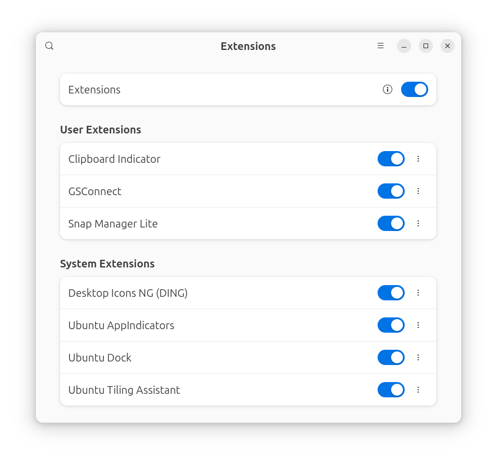
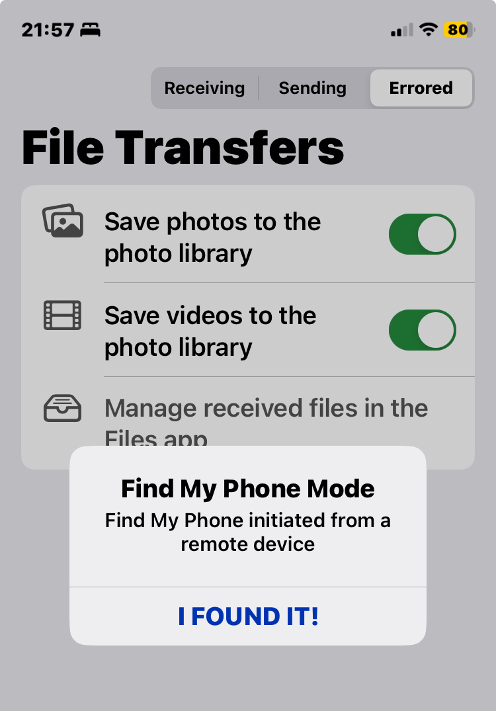
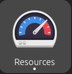

# Fill the Toolbox


----------------------------------------------------------------

:arrow_forward: KEY TAKEAWAYS

- Ubuntu is built off of Debian Linux so any tools that are compatible with Debian will probably work on Ubuntu.
- Ubuntu comes with the [The app store for Linux](https://snapcraft.io/) built in. Thousands of applications are available.
- Ubuntu supports [Flat Pack](https://flathub.org/) applications.
- Ubuntu Supports [App Images](https://appimage.org/). Linux apps that run anywhere!
- If you are coming from MacOS, you can use [Homebrew](https://docs.brew.sh/Homebrew-on-Linux) to install packages.
- Thousands of networking tools are available on [github](github.com)
- Packet Pushers network maintains a list of [Open Source Networking Projects](https://packetpushers.net/blog/open-source-networking-projects/). Most work on Ubuntu.

----------------------------------------------------------------

## Introduction

The super power of Linux for a network engineer is how easy it is to create a vlan on an interface and tag it, all of the Unix tools that are built is such as `awk, grep, sed, sort` that allow you to quickly pull data out of files, change text inside files and print out results, and all the free open source projects for networking such as [My Traceroute](https://www.baeldung.com/linux/mtr-command), and [sipcalc](https://www.cyberciti.biz/tips/perform-simple-manipulation-of-ip-addresse.html).

I did a refresh at a customer with 72 sites. They were replacing Cisco 3750s with HPE 2930s. There were a lot of IoT type devices like body cameras, door access controllers, surveillance cameras, etc. that they wanted verified after the cutover. I have a python script on my [github](https://github.com/rikosintie/ARP-Sort) that takes the output of `show ip arp` and creates a file with the mac address/ip address in a python dictionary. The output of that script is sent to a second script located [here](https://github.com/rikosintie/MAC2Manuf) that uses the output of `show mac address interface g1/0/1` and the dictionary to build a table of the:

- vlan
- ip address
- MAC address
- port number
- manufacturer

for each entry in the dictionary. Here is a sample of the table created:

```text
Number of Entries: 184

Device Name: Cisco-6509
Vlan   IP Address       MAC Address       Type       Interface   Vendor
-------------------------------------------------------------------------------
  42   10.50.43.84      ac8b.a915.301e    dynamic    Gi3/41      Ubiquiti
--------------------------------------------------------------------------------
  42   10.50.43.43      0002.9908.53f0    dynamic    Gi3/43      Apex
--------------------------------------------------------------------------------
 900   10.254.50.106    000b.86b7.ac5f    dynamic    Gi3/44      ArubaaHe
-------------------------------------------------------------------------------
```

I used grep and sort to pull out the devices that needed to be verified. Here is an example:

```text hl_lines='1'
grep -E 'Uni|Axi|Aru|Chec|Sam|Sony|Hew|Honey|SHARP|Pronet|IB|Digiboar|Siemens|Tanta|Bosch|Videx|Industr|WatchG|Zebra|Conte' Cisco-6509-ports.txt | sort -b -k 5
  35   10.50.35.15      80c1.6e91.99b1    dynamic    Gi3/25      HewlettP
  35   10.50.35.23      aca8.8e51.3221    dynamic    Gi3/25      SHARP
  40   10.50.40.96      0020.4afb.8f89    dynamic    Gi3/38      Pronet
  42   10.50.42.198     24de.c6cc.5792    dynamic    Gi3/41      ArubaaHe
  42   10.50.43.150     0020.4a0b.e40f    dynamic    Gi3/41      Pronet
 900   10.254.50.106    000b.86b7.ac5f    dynamic    Gi3/44      ArubaaHe
  40   10.50.40.17      84d4.7ecf.937e    dynamic    Gi3/47      ArubaaHe
 905   10.254.50.37     001a.1e06.c0a8    dynamic    Gi4/35      ArubaaHe
 906   10.254.50.37     001a.1e06.c0a8    dynamic    Gi4/36      ArubaaHe
 901   10.254.50.106    000b.86b7.ac5f    dynamic    Gi4/37      ArubaaHe
  42   10.50.43.251     0040.8420.700b    dynamic    Gi8/1       Honeywel
  42   10.50.42.221     a08c.fd68.f4f5    dynamic    Gi9/10      HewlettP
  42   10.50.42.71      001d.9608.7fe1    dynamic    Gi9/24      WatchGua
  42   10.50.43.107     001d.9608.7fe5    dynamic    Gi9/24      WatchGua
  42   10.50.43.113     001d.9608.7fe2    dynamic    Gi9/24      WatchGua
  42   10.50.43.127     001d.9608.7fe0    dynamic    Gi9/24      WatchGua
  42   10.50.43.138     001d.9608.7fe6    dynamic    Gi9/24      WatchGua
  42   10.50.42.79      0030.6ec5.d6e6    dynamic    Gi9/36      HewlettP
  42   10.50.43.159     7446.a050.ca72    dynamic    Gi9/36      HewlettP
  42   10.50.43.78      c8d9.d2b6.dbdb    dynamic    Gi9/36      HewlettP
  42   10.50.43.195     aca8.8e76.b63f    dynamic    Gi9/36      SHARP
```

Grep is used to search for the terms, the `|` means OR and then `sort -b -k 5`  means ignore leading blanks, sort by the 5th column.

With 72 sites, an average of 4 switches per site, you can image how long it would have taken using Notepad to open 288 files and copy the data out? but with the grep/sort line it took seconds. And the interfaces are in order so it's easy to match the `running configuration` to the output.

We will cover terminal tools later. In this section we will learn how to install graphical tools using `Flatpaks`, `Snaps` and `Appimages`

----------------------------------------------------------------

## Snaps vs Flatpak vs Appimage

For years Linux distributions have used a `Package Manager` to install applications. On linux, Applications were called packages. The problem with package managers is that Debian/Ubuntu used a different package manager than Redhat/Centos, which used a different package manager than Arch, which used a different package manager than SUSE. And on and on. This meant any developer who wanted to create Linux applications had to create packages for every manager. That was not popular with developers and held Linux adoption back.

To work around this problem, AppImage, Snaps and Flatpaks were developed. It's the old "Pick a standard, any standard" joke. We now have a package installer format that works on all platforms but there are three of them. This article explains the who, and how of the three - [Flatpak vs. Snap vs. AppImage](https://phoenixnap.com/kb/flatpak-vs-snap-vs-appimage).

Most importantly for us is that Snaps were developed by Canonical, the publisher of Ubuntu so it's built into Ubuntu. But Flatpak was developed for Gnome, KDE and FreeDesktop. This was before Ubuntu switched to the Gnome desktop. So the Gnome project has several applications for managing the Gnome desktop. I like the ones listed below, especially for users coming to Ubuntu from Windows. These 4 are very similar to Windows applications.

----------------------------------------------------------------

## Flatpak Applications

I am going to start with flatpak applications instead of the Ubuntu App Store because there are four flatpak applications that are helpful for managing the system.

The Flatpak store is located [here](https://flathub.org/). There are Thousands of applications that you can browse and install. Most are free open source software (FOSS). Some will have a `Donate` button. If you install the application and find it useful please go back and donate. Most of the applications are written by developers that don't get paid.

### Install Flatpak

Open a terminal (ctrl+alt+t) and run the following commands:

```bash
sudo apt update
sudo apt install flatpak
flatpak remote-add --if-not-exists flathub https://dl.flathub.org/repo/flathub.flatpakrepo
```

Unfortunately you do have to restart after running the commands. Once your system restarts we are going to install four applications for managing the system.

----------------------------------------------------------------

### Gnome Extensions


The first application is `Gnome Extensions`

The Gnome project maintains an [Extensions Site](https://extensions.gnome.org/) where you can install "Extensions". These are small programs that add functionality to the Gnome Desktop. I try to keep the number of extensions to a minimum because of performance and stability issues. This article [Top 21 GNOME Extensions to Enhance Your Experience](https://itsfoss.com/best-gnome-extensions/) lists the extensions that `itsfoss` recommends.

`Gnome Extensions` handles updating extensions, configuring extension preferences and removing or disabling unwanted extensions.

**Installation Instructions**

```bash
flatpak install flathub org.gnome.Extensions
```

Once installed you run `Extensions` from the terminal using:

```bash
flatpak run org.gnome.Extensions
```

Or by tapping the Super key, typing `extension` and clicking on the Extensions icon.

Below is a screenshot of the `Gnome Extensions` application running on my laptop:



----------------------------------------------------------------

I only use three extensions:

- [Clipboard Indicator](https://github.com/Tudmotu/gnome-shell-extension-clipboard-indicator) - The most popular, reliable and feature-rich clipboard manager for GNOME with over 1M downloads.
- [GSConnect](https://github.com/GSConnect/gnome-shell-extension-gsconnect) - With GSConnect you can securely connect to mobile devices
- [Snap Manager lite](https://github.com/fthx/snap-manager-lite) - Popup menu in the top bar to easily manage usual snap tasks (list, changes, refresh, remove, install...)

#### Clipboard Indicator

There are a lot of clipboard managers out there. I went with this one because it is a Gnome extension (There are installable applications available) and had good ratings. Here is what it looks like in use:


Clicking on `Settings` brings up a dialog with tons of options. The only option I changed is `Notifications, show notification on copy` so that I get a popup message when I copy something to the clipboard.

----------------------------------------------------------------

#### GSConnect

If you use an Android phone this application is a must! It allows you to send/receive text messages, send files to the phone, and much more. iPhone is more limited because Apple won't allow iMessages support. But with RCS rolling out in IOS 18 that might change.

One nice feature that works on IOS and Android is `find my phone`! I always misplace my phone when working in closets and with GSConnect I can quickly make it ring to locate it.

**Open GSConnect Settings**

From the Gnome Extensions application, click on the 3 dots after the slider for GSConnect and select `Settings`:


----------------------------------------------------------------

#### Installing the KDE application on the phone

GSConnect is a Gnome port of the KDE Connect application. On the settings dialog you will see links to:

- Android Play Store
- Apple App Store
- Sailfish OS OpenRepos
- F-Droid

Go the the appropriate store and install the KDE Connect application on your phone. Follow the instructions for connecting to GSConnect.

From the Settings dialog you will see all devices that have connected and their status:


I enabled the `GSConnect remains active when Gnome Shell is locked` slider so that the phone remains connected when I lock the desktop.

----------------------------------------------------------------

The icon for GSConnect is in the menu bar at the top right of the screen:


You can see `Find My` and `Share` in the screenshot. The `Find my phone` will keep ringing until you press the `I Found It` button on the phone.

----------------------------------------------------------------



----------------------------------------------------------------

#### Snap Manager Lite

This extension allows you to install and manage snaps:


One annoying feature of snaps is that they install as `Loop` devices. This means that when you run `lsblk` from the terminal to view your disks you seen a lot of `loop` entries. To avoid this, use this instead:

```bash
lsblk -e7
```

You could create an alias in the `.bahsrc` or `.zshrc` file using:

```bash
alias lsblk='lsblk -e7'
```

If you don't want to have to type the `-e7`.

----------------------------------------------------------------

### Gnome Resources

 

Gnome Resources is similar to the Windows Task Manager. Here is a [link](https://apps.gnome.org/Resources/) to the homepage describing Resources.

**Installation Instructions**

```bash
flatpak install flathub net.nokyan.Resources
```

Once installed you run `Resources` from the terminal using:

```bash
flatpak run net.nokyan.Resources
```

Or by tapping the `Super` key, typing res and clicking on the Resources icon.

----------------------------------------------------------------

### Flatseal


Flatseal is a graphical utility to review and modify permissions from your Flatpak applications. This application allows you to look at all your installed Flatpak applications and verify their permissions.

**Installation Instructions**

```bash
flatpak install flathub com.github.tchx84.Flatseal
```

Once installed you run `Flatseal` from the terminal using:

```bash
flatpak run com.github.tchx84.Flatseal
```

Or by tapping the `Super` key, typing flat and clicking on the Flatseal icon.

You will be able to see all of the flatpak applications that are installed when flatseal opens. From the terminal you can run:

```bash
flatpak list --app
```

To see the same list of applications. The `--app` limits the output to just applications. If you omit it, you will see flatpak runtime applications needed to make the flatpak infrastructure work.

### List of flatpak applications with install Instructions

If you want to install the flatpak applications on a different machine:

```bash linenums=1 hl_lines='1'
flatpak list --app | sed -e "s/^[^\t]*//" -e "s/^\t/flatpak install /" -e "s/\t.*$//"
flatpak install cc.arduino.arduinoide
flatpak install com.github.PintaProject.Pinta
flatpak install com.github.johnfactotum.Foliate
flatpak install com.github.tchx84.Flatseal
flatpak install com.jgraph.drawio.desktop
flatpak install com.mattjakeman.ExtensionManager
flatpak install com.usebottles.bottles
flatpak install fr.rubet.rpn
flatpak install io.github.cboxdoerfer.FSearch
flatpak install io.github.flattool.Warehouse
flatpak install net.nokyan.Resources
flatpak install net.werwolv.ImHex
flatpak install org.gnome.baobab
flatpak install org.gnome.meld
```

Here is a screenshot of the extensions I have installed:

 

----------------------------------------------------------------

### Gnome Disk Usage analyzer


**Installation Instructions**

```bash
flatpak install flathub org.gnome.baobab
```

Once installed you run `Flatseal` from the terminal using:

```bash
flatpak run org.gnome.baobab
```

Or by tapping the `Super` key, typing disk and clicking on the disk icon.

```bash
flatpak run org.gnome.baobab
```

Disk Usage analyzer is similar to disk usage tools on Windows and Mac. Here is a screenshot of the disk usage on my home folder:


I hovered over one of the large blocks and it told me that is the section of disk holding my Inbox. Since my email client is Thunderbird I expanded the `.thunderbird` folder and then I could see `sent mail` and other folders.

----------------------------------------------------------------


----------------------------------------------------------------

Now that we have the four management applications installed let's find some tools useful to a network engineer!

----------------------------------------------------------------

----------------------------------------------------------------

FreeCAD

Draw.io


----------------------------------------------------------------

## The Ubuntu App store

### PacketSender


A cross platform open source tool. Available for Mac, Linux, Windows.

**Features**
Packet Sender can send and receive UDP, TCP, SSL, and DTLS on the ports of your choosing. It also has a built-in HTTP client for GET/POST requests and Panel Generation for the creation of complex control systems.

Common Uses
Packet Sender was designed to be very easy to use while still providing enough features for power users.

• Test automation
Using its command line tool or hotkeys

• Testing network APIs
Using the built-in UDP/TCP/SSL/DTLS clients

• Malware analysis
using the built-in UDP/TCP/SSL/DTLS servers

• Panel Generation
Create single-button panels that trigger a series of commands for control systems.

• Testing HTTP
Single-button GET/POST requests for control systems.

• Intense Traffic
Flood at a particular rate to stress-test devices

• Testing network connectivity/firewalls
by having 2 Packet Senders talk to each other

• Tech support
by sending customers a portable Packet Sender with pre-defined settings and packets

• Security research
Send SSL and then analyze the traffic log.

**Installation Instructions**
