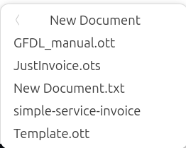

# Using Ubuntu


----------------------------------------------------------------

:arrow_forward: KEY TAKEAWAYS

- It's surprising easy switch from MS Windows to Ubuntu 24.04
- There are no license fees to use Ubuntu
- Ubuntu's desktop and files manager are very similar to Windows 10
- You can customize so many things in Ubuntu that you can't customize in Windows

----------------------------------------------------------------

Switching from Windows to Ubuntu with the Gnome desktop is easy and hard. How can that be? It's simple, the basic operation of the desktop is similar to Windows. The file manager (Files) is similar to Windows Explorer and of course, Chrome or Edge work just like they do in Windows including syncing, extensions, etc. There is a keyboard button called the superkey (on most keyboards it will have the Windows logo) just like the Windows key. You tap it and search for an application or pick from the running applications.

So, what is the hard part? Things like killing a hung application, searching for files from the terminal, and checking free disk space are different and will take a little getting used to. It's a lot like working on Cisco IOS for years and then having to work on an Aruba or Juniper switch. At first, it's frustrating, you have to look up commands and do some things differently.

The reason for this guide is to help get you past the hurdles so that you can start enjoying Ubuntu. I promise that if you get over the hump your productivity as a network engineer will soar. Since MacOS is based on Open BSD Unix,
once your muscle memory is up to speed you can jump back and forth easily between Windows, Mac and Linux. In a later chapter I will discuss the terminal tools that make Linux so much fun and so powerful for
a network engineer.

----------------------------------------------------------------

## Desktop Environments in Linux

One of the big advantages for Linux is that you can customize almost everything since it's open source. You can change the terminal you use, the file manager, the way almost anything works and even the desktop itself.

The first choice you have to make with Ubuntu is which Desktop Environment do  you want to use. The two most popular desktop environments (DE) for Linux are Gnome (Ubuntu’s default), and KDE (which is available on Ubuntu) but there are many more. Gnome is the most popular Desktop Environment in Linux and I just learned to customize Gnome to fit my workflow. Here is a TecMint article on [Desktop Environments](https://www.tecmint.com/top-best-linux-lightweight-desktop-environments/) that will explain the differences between them. My advice is to start out with Ubuntu and Gnome until you are comfortable.

I listen to a lot of podcasts on Linux and KDE, XFCE and MATE are highly recommended desktop environments (DE) that you may like better than Gnome. If you watched the second episode of Mr. Robot (Season 1 – which I highly recommend) there is a scene were an executive tells Elliot that he runs KDE but
understands why Elliott prefers Gnome.

These two short YouTube videos sum it up better than I can:

- [6 Things to Know When Switching to Linux from Windows](https://www.youtube.com/watch?v=wcdquhB6hT8)
- [10 things you can do with Linux that you can't do with Windows](https://www.youtube.com/watch?v=JOOkfGv58u0)

----------------------------------------------------------------

## Podcasts on Linux

There are a lot of podcasts dedicated to Linux. In your podcast application just search Linux. My favorites are:

- Destination Linux - A weekly podcast on general Open Source topics.
- Late Night Linux - A weekly podcast on Linux and the wider tech industry. NOTE: Lots of F bombs!
- Linux After Dark - A weekly podcast on Linux experiences.
- Linux Dev Time - A weekly podcast on Developing on Linux
- Linux Downtime - A weekly podcast "From working in the Industry and progressing your career, to managing a project's community"
- Linux Unplugged - A weekly podcast on Linux by Jupiter Broadcasting. Covers news and applications for Linux.
- This Week in Linux - A weekly podcast on Linux

----------------------------------------------------------------

## Casting your display

I have a Vizio “Smart” TV with Chromecast built in. Using the Chrome browser I can click the three dot menu on the right and select “Cast...” to send the output to the TV.

In VLC, select “Playback, Renderer” to send VLC’s output to the TV. I don’t have a Chromecast dongle, but I am guessing it would work the same way as the Vizio TV.

----------------------------------------------------------------

## Using RDP to share the Ubuntu desktop

Ubuntu 24.04 has an RDP server built in. To enable it:

- Tap the `super key` (Windows key on some laptops), type `settings` and press `enter`.
- In the top left corner of the screen click on the magnifying glass, type rdp.
- Click on the resulting `System`
- Click on `Remote Desktop`, enable `Desktop Sharing` and `Remote Control`
- Under `login details`, click on the eyeball icon so show the password
- Add port 3389 to the firewall using `sudo ufw allow from any to any port 3389 proto tcp`

You can now use Windows RDP or any RDP client to connect to your laptop!

For a more detailed tutorial see [Ubuntu Remote Desktop Access from Windows 10/11](https://linuxconfig.org/ubuntu-20-04-remote-desktop-access-from-windows-10
)

----------------------------------------------------------------

## Working with Applications

Like in Windows, there are many ways to open applications in Gnome.

### The Super Key

You can hit the Windows key (Superkey is what it's called in Ubuntu) to bring up a search box.


Notice that the files application icon has two dots on the left side. That's because I have two separate windows open. If you click on the icon, the screen will change to show the two files windows.


----------------------------------------------------------------

### Search for an application

To open an application using search, simply tap the super key and start typing the name of the application in the search box. As you
type, all the matching applications will be displayed below the search box. If the one you want is the first one
displayed on the left you can just hit enter. If not, keep typing and the list of displayed applications will get
smaller. In the screenshot below, hitting enter will open the built in calculator app. Right arrow, Enter will open
LibreOffice Calc!


You can also use the mouse and click on any application that is displayed to open it.

----------------------------------------------------------------

### Switching Applications

Tap the super key (Windows key on some keyboards). Below the search box are the applications that are currently running. If you want to switch to one of the open applications, you can use the Tab key and [enter] or use the mouse to select one of the running applications.

You can also use ctrl+tab just like in Windows.

Finally, you can use the dock to open applications that you have pinned to it and switch to an open application.

----------------------------------------------------------------

### Viewing all installed applications

The dock has a small icon at the bottom, it’s three rows of three dots. You can click that icon to see the
installed applications in a window.


If there are too many to display, a column of circles will appear at the bottom of the screen and and an arrow on the right side. You can scroll down with the mouse button, click on one of the circles or click the arrow on the right to jump to the next page. As you can see, it’s very easy to open applications in Ubuntu.


!!! note
    Ubuntu 24.10 has changed the icon to an Ubuntu icon instead of the dots.

    

----------------------------------------------------------------

### Switching between multiple open windows in the same application

If you have several copies of the same application open you can switch between them using the super key + ~ key (the key to the left of 1 on a US keyboard). You can also bring up the dock, click on the application
icon and then select the one you want but the keyboard is much easier and faster.

For Example, in LibreCalc I often have a lot of spreadsheets open. To switch to a different sheet I can use the super + ` key combination. On a US keyboard that is the key to teh left of the 1 key. Here is a screenshot of two spreadsheets.


----------------------------------------------------------------

## Configuring the Dock

Like Windows and Mac, Ubuntu with the Gnome DE has a dock. You customize the dock using the Gnome Settings application. To open the Gnome Settings application, click on "Activities Overview" icon at the top right corner of the
screen, then select the gear icon. This will open the "settings" application. It’s very similar to “System Preferences” on the Mac or Control Panel on Windows.

At the top left corner of the screen there is a magnifying glass. Click it and enter "dock". The dock is under "Ubuntu Desktop".


One thing I do to help me use all three operating systems
is to customize the dock to be similar across all OSes. I set Windows, Mac and Linux to display it on the left
because I am almost 100% of the time on a laptop and the screen is wider than it is high. I also set the dock to
auto-hide and display a few commonly used apps.

Using the super key and typing the first few letters is now my preferred work flow rather than clicking on an
icon in the dock. One thing I like about Ubuntu is that when I’m using multiple monitors it puts the dock on all
the monitors.

----------------------------------------------------------------

## Customizing Gnome - The Tweaks Tool

Ubuntu ships with Gnome as the desktop environment (DE). Unlike Windows, Linux distributions can use a lot of different desktop environments (DE). Gnome is the default desktop environment for Ubuntu and Redhat (CentOS) so it has a large percentage of the desktop market in Linux. If you want to try others there are several official flavors of Ubuntu that you can download from Canonical.

First, install the Gnome Tweak Tool. This tool allows you to change a lot of the Gnome settings to your preference. Open a terminal window, `ctrl+alt+t`, and type the following:

`sudo apt install gnome-tweak-tool`

Press [enter], you will be prompted for your password because of sudo, and the install will start. When it finishes, hit the super key, type

`tweaks`

and hit [enter].


----------------------------------------------------------------

### Startup Applications

Gnome Tweaks is where you set the applications that run on startup. I try to keep these to a minimum. It's easy to forget that some application you don't use anymore is automatically starting and using system resources.

There are a lot of options that you can "tweak" with the tool. I don't make a lot of changes but I do like having the Top Bar show Day, Data and Time.

----------------------------------------------------------------

## Using the GUI Files application

Files is the file manager for Gnome. The Gnome team is very creative with application names! The text editor is named "Text Editor", I kid you not. It makes Googling for tips a bit of a challenge.

File used to be named `nautilus` and you can still launch the application from the terminal using `nautilus`. If you are having issue with Files starting, for example you get a dialog saying "Files is not responding" with a Force quit and a Wait button you so

If you click on the hamburger menu, or press `ctrl+,` you will see `Preferences`. Two options are available that I always enable:

- Sort Folders Before Files
- Expandable Folders in List View

The `Expandable Folders` option puts a `>` symbol beside the folder name. Clicking the symbols expands the folder


### Tabs

Files works well and has a feature I love – Tabs! Once you get used to having tabs in your file manager it’s hard to use Windows Explorer! Below is a screenshot with three tabs open. You can see how convenient this is.

On a Mac, the Finder app has tabs. I don’t know why Windows doesn’t. (Note: Windows 11 22H2 added tabs)

----------------------------------------------------------------

Files has an extensive right click menu. Here are the options for the folder `Scripts`. You can see the `>` symbol beside the folder name.


----------------------------------------------------------------

I use the `list` view to list files. You can right click just to the left of the list of folders to bring up the folder options. See the next image:


----------------------------------------------------------------

The dialog has options for:

- New Folder - Create a new folder.
- New Document - Create a new document based off of a template.
- Open With... - This is an odd one. It allows you to select an application to - open a new folder with.
- Paste - If you have copied a file, a Paste menu will appear, otherwise it's greyed out.
- Paste as link - Similar to a `shortcut` on Windows.
- Select All - Selects all folders.
- Visible Columns - This opens a dialog where you can choose which columns are visible.
- Open in Terminal - Opens the Ubuntu Terminal in this folder.
- Open as Administrator - Open a new window running with root privileges.
- Properties - Shows the size of the folder and the permissions of the folder.

----------------------------------------------------------------

### New Document

You can create templates in the `/home/$USER/templates` folder for the document types that you use on a regular basis. To create a template:

- Open the application you want to create a template for
- Set any options for the template
- Save the file in the `/home/$USER/templates` folder. For example, my template folder is `/home/mhubbard/templates`

For example, I wanted a plain text template so I opened `Text Editor` and saved the blank document as New_Text_Document.txt in the templates folder. Now when I right click I can select `New_Txt_Document.txt` for a blank text file.

I right clicked over the `New_Text_Document.txt` file and selected `Open With` then set VS Code as the `Always use for this type of file` option.


----------------------------------------------------------------

You can also create LibreOffice templates. The templates that end in `.ott` are for LibreOffice Writer and templates that end in `.ots` are for LibreOffice Calc.



----------------------------------------------------------------

### Visible Columns

There are a lot of options for which columns to display:


----------------------------------------------------------------

### Open as Administrator

This one is very useful is you like to use GUI applications for files that require root privileges. You can also click you mouse into the address bar and type `admin:` to change the current window to root. You will be prompted for your password. Then you can open files as root.

----------------------------------------------------------------

### Open a new Tab

You can use the keyboard shortcut `ctrl+t` to create a new tab, click the `Hamburger menu` and select New Tab. This will open the current folder in a new tab.

If your mouse has a center button, you can select a folder and click it to open the selected folder in a new tab!

----------------------------------------------------------------

### Keyboard shortcuts

Gnome Files has a lot of keyboard shortcuts. If you click the hamburger menu or press `ctrl+?` it will open a dialog displaying the shortcuts. There are 3 pages of them!

----------------------------------------------------------------

### Creating archives

From the right click menu you can select "Compress..." to create an archive. The `Compress...` menu supports:

- zip
- 7zip (Must install 7z `sudo apt install 7zip`)
- tar.xz

----------------------------------------------------------------

### Display the Full path in files

Sometimes you want to copy the full path to a file when working in the file manager. Hit ctrl+l (lowercase el) and the path will change to a format that you can copy.


----------------------------------------------------------------

### Easily preview files in Files

One thing I missed from Windows Explorer was the preview pane. In Ubuntu running the Gnome desktop you can install "Sushi" to preview files. Then you just hit the space bar to preview a supported file format.

To install GNOME Sushi using Ubuntu Software, click the following link:

```bash linenums='1' hl_lines='1'
sudo apt install gnome-sushi
```

For a more detailed description see
[How to Quickly Preview a File in Ubuntu's File Manager (Like "Quick Look" in macOS)](https://www.howtogeek.com/277987/how-to-quickly-preview-a-file-in-ubuntus-file-manager-like-quick-look-in-macos/)

----------------------------------------------------------------

### Search

The completely new "Files" application in Gnome 46 (Ubuntu 24.04) is amazing. Here is the announcement from the project [Introducing GNOME 46, “Kathmandu”](https://release.gnome.org/46/)

One of the best features in Files is the new search. Just click on the magnifying glass next to the address bar and enter some text. Unlike in Windows, you can enter text that is in the middle of the filename. In the screenshot below, I entered "new" and it found "frequent-new.png" in a directory one level down.


You can click on the funnel icon after you open search and filter on:

- Date
  - Created
    - Last Modified
    - Last Used
- What - There are well over 100 file types to choose from
- Full Text or Filename

Ubuntu has an article on using the new feature here: [Search for files](https://help.ubuntu.com/stable/ubuntu-help/files-search.html.en#:~:text=Open%20the%20Files%20application%20from,shown%20in%20the%20search%20bar.)

Ubuntu also has a [Common Tasks](https://help.ubuntu.com/stable/ubuntu-help/files.html.en#more-file-tasks) page for Files

----------------------------------------------------------------

### I have a red Lock icon on a file or folder

Files, like every other GUI file manager, uses icons to represent files and folders. If the icon has a green check mark in it, you have full access to the file or folder.

If the icon has a red lock in it, you don’t have full
permissions to the file or folder.
Here is a screenshot of Files showing a file with a red x.


To take ownership of the file, open the terminal and enter:

`sudo chown mhubbard testsync.txt`

You will be prompted to enter your password.

### I have a grey X on a file or folder

If the file has a grey square icon with an X in it the file is read only.


----------------------------------------------------------------

**References for the Files app**

- [Meaning of files-folders with a red x](https://askubuntu.com/questions/835588/meaning-of-files-folders-with-a-red-gray-x-on-them/835590)
- [10 tips for Gnome Files](https://www.youtube.com/watch?v=tR5uDUlZJNA) - A 10 minute video that is worth watching.

----------------------------------------------------------------

## Creating a bootable USB stick from an ISO image

You don't need a third-party tool to create a bootable USB stick on Linux if you don't mind using the terminal.

### Use dd to make bootable flash

!!! Note

    Ubuntu uses a system called "snaps" to sandbox applications. The drawback to snaps is that they mount every application using a "squashfs". I use the following alias so that I don't have to see all the applications.

`alias df="df -h --exclude=squashfs"`

To add the alisa to bash:

```bash linenums='1' hl_lines='1 3'
gnome-text-editor ~/.bashrc
or
gnome-text-editor ~/.zshrc
```

Depending on what your shell is. The default shell is bash. I will go over changing the shell to zsh later on.

If you create the alias you can use df -h instead of including the --exclude=squashfs option.

- run df -h --exclude=squashfs
- Insert the flash drive
- run df -h --exclude=squashfs

Look for a new entry in the table. For example, on my laptop I have two flash drives mounted.

```bash linenums='1'
Filesystem      Size  Used Avail Use% Mounted on
tmpfs           3.2G  4.0M  3.1G   1% /run
/dev/nvme0n1p2  457G  392G   43G  91% /
tmpfs            16G  219M   16G   2% /dev/shm
tmpfs           5.0M   12K  5.0M   1% /run/lock
efivarfs        384K   80K  300K  21% /sys/firmware/efi/efivars
/dev/nvme0n1p1  513M   31M  483M   6% /boot/efi
tmpfs           3.2G  1.3M  3.2G   1% /run/user/1000
/dev/sdc1       7.5G  4.1G  3.5G  55% /media/mhubbard/C253-EE9A
/dev/sdb1       116G  5.0G  111G   5% /media/mhubbard/LINUX-ARCHI
```

The two flash drives are /dev/sdc1 and /dev/sdb1. I can tell because they are listed as /media/mhubbard which is the mount point for the flash drives.

In this example I am burning System Rescue to the flash drive.
Parameters:

- if - input file name
- of - output filename
- bs - Block size to use
- status=progress - display progress
- && sync - In Linux the "&&" means finish the first command then run the next command. In this case sync the writes to make sure it's ejected cleanly
Enter the following:

`dd if=systemrescue.iso of=/dev/sdb bs=10M status=progress && sync`

!!! Note "Be careful if you use this method"

    dd is commonly referred to as "disk destroyer", meaning that it starts as soon as you hit enter, there are no "Are you sure" prompts.

MAKE SURE THAT YOU HAVE THE OF (output file) SET TO THE FLASH DRIVE!!

----------------------------------------------------------------

### Use the Ubuntu "Make Startup disk" tool

You can use the built in “Startup disk creator” by tapping the super key (Windows Key) and typing `start`. You will see the Startup disk icon:


- Pick the ISO image from the “Source disc image (.iso)” drop down
- Then select the USB stick from "Disk to Use"
- Click “Make Startup Disk”
- You will be prompted to select "Yes or No"


In this example, I am burning Kali Linux 2023.3 to the flash drive.

----------------------------------------------------------------

### Use qemu to test a startup disk

You can install qemu and create a simple virtual machine to test a startup disk. I'm not going to cover that but these two articles will explain.

- [How do I install qemu on Ubuntu 23.10?](https://askubuntu.com/questions/1490805/how-do-i-install-qemu-on-ubuntu-23-10)
- [Using QEMU to quickly test an ISO or bootable USB drive](https://makandracards.com/makandra/1192-using-qemu-to-quickly-test-an-iso-or-bootable-usb-drive)

----------------------------------------------------------------

## Working with the Linux File System

If you have been a Windows user for a long time the hardest part of switching to Linux is the file system. There is no concept of drive letters in Linux. The Linux file system is based on the “File system Hierarchy Standard” maintained by the Linux Foundation.

The top of the Linux file system is called the root. All files and directories are referenced from the root, even if they are stored on different physical or virtual devices. That is so different from Windows that it will take some
time to get comfortable with.

Here is a link to a great tutorial on the Linux file system by Abhishek Prakash - [Linux Directory Structure Explained for Beginners](https://linuxhandbook.com/linux-directory-structure/). His tutorial will get you up to speed on the Linux file system. Abhishek creates Linux tutorials and I recommend that you sign up for his newsletter. The subscribe button is at the top of the page.

On Windows you have drive letters and the root of the file system is the “\” character – The good old C:\. But Linux/Mac, or any *NIX for that matter, doesn’t use drive letters. The file system is usually described as a tree
with root at the beginning. Root is shown in the file system as /. Everything is then displayed off the root. The “/” is another difference that will take a while to get used to. Unix/Linux/Mac use a forward slash instead of the backslash “\” for file system commands. When you use a web browser, you use the forward slash for file commands – <https://github.com/rikosintie> for example.

----------------------------------------------------------------

### LSBLK

For a quick look at block devices (hard drives, thumb drives, nvme, etc.) on the system, you can use the "list block devices" command - lsblk. Here is an lsblk listing on my Dell laptop which has an m.2 NVME drive with the OS on it and 1TB SSD for data.

```bash linenums='1' hl_lines='1'
$ lsblk -e7
NAME        MAJ:MIN RM   SIZE RO TYPE MOUNTPOINTS
sda           8:0    0 931.5G  0 disk /media/mhubbard/Data
nvme0n1     259:0    0 465.8G  0 disk
├─nvme0n1p1 259:1    0 513.1M  0 part /boot/efi
└─nvme0n1p2 259:2    0 465.3G  0 part /
```

Notice that I included -e7 on the end of the `lsblk` command. That is because Ubuntu uses "snaps" for a lot of applications and the show up as "loop" devices in lsblk. The -e means exclude and 7 is the number loop devices.

So you can see that I have an NVME drive called nvme01n1. There are two partitions on the nvme drive:

- nvme01n1p1
- nvme01n1p2

P1 is the boot partition and p2 has the operating system. Notice
that nvme0n1p2 is type partition and mount is /. That means nvme0n1p2 is the root of the file system.

There is also a "block device" named sda. This is a 1TB SATA SSD drive and it's mounted at /media/mhubbard/Data off the root.


The display needs a little explanation. For the disk labeled “Ubuntu” it says 45.4 GB / 490.6 GB available.
That actually means it’s a 490.6GB drive with 45.4GB available.

Once you get used to it, this seems more intuitive and easier to scale than the drive letter model used by Windows. You will also notice in the lsblk output that Linux/Mac, and again all *NIX systems, use the forward
slash as a delimiter rather than the backslash.

Linux has many “ls” commands for listing things:

- lsblk – list block level devices like disk drives, thumb drives, etc.
- lspci – list the PCI bus devices on the system
- lsusb – list USB bus devices
- lsof – list open files
- lslogins – list logins
- lsmod – list the status of modules inserted into the kernel

I will cover each of these a later in this section.

To list the commands that start with "ls" you can type ls and press [tab]. This works with any Linux command. Just like in a Cisco switch, Linux has "tab completion" but it will also show you a list f all commands that match.

```bash
$ ls
ls           lsattr       lsb_release  LSCOLORS     lsdiff       lsinitramfs  lslocks      lsmem        lsns         lspci        lspgpot      lsusb
lsa          lsblk        LS_COLORS    lscpu        lshw         lsipc        lslogins     lsmod        lsof         lspcmcia     lspower

```

----------------------------------------------------------------

### LSUSB

Linux makes it easy to see what USB devices are connected, who the manufacturer is and what the Product ID (PID) and Vendor ID (VID) are.

In this example, I have a USB to Serial adapter connected. It uses the Future Technology Devices International (FTDI) UART. It’s connected to Bus 001, the Vendor ID is 0403, and the Product ID is 6001.

```bash linenums='1' hl_lines='1 3'
lsusb
Bus 002 Device 001: ID 1d6b:0003 Linux Foundation 3.0 root hub
Bus 001 Device 002: ID 0c45:6a08 Microdia
Bus 001 Device 003: ID 8087:0aaa Intel Corp.
Bus 001 Device 006: ID 0403:6001 Future Technology Devices International, Ltd FT232 USB-Serial (UART) IC
Bus 001 Device 001: ID 1d6b:0002 Linux Foundation 2.0 root hub
```

This is a very useful command once you make it part of your skill set. Anytime you connect a USB device you can quickly see who the manufacturer of the chipset is. This is especially useful if the device isn’t working correctly and want to Google for some information.

Another command that will help here is dmesg. This displays the system messages that have been logged. With the `lsusb` command above you can see a Future Technology USB-Serial adapter has been inserted.

If I run:

```bash linenums='1' hl_lines='1'
sudo dmesg | grep FT232
[83003.234941] usb 1-3: Product: FT232R USB UART
[83003.242719] usb 1-3: Detected FT232RL
[106493.653320] usb 1-3: Detected FT232RL
```

You can see that the system logged the insertion of the UART.
To see what kernel module is loaded for the UART (Note – I am only showing the UART module. Other USB kernel modules were displayed):

```bash linenums='1'
lsmod | grep usb
usbserial
49152 3 ftdi_sio
```

In this example the Future Technology USB-Serial adapter is working correctly but you would do the same things to troubleshoot a device that wasn’t working.
The big difference over Windows is that support for a device in Linux is built into the kernel and loads when the device is inserted.

There are cases where there is no support in the kernel and you will have to go to the manufacturer’s site and download a kernel module (driver in Windows).

The steps above will quickly let you
know that the device isn’t being discovered by Linux

----------------------------------------------------------------

## Gnome System Tool (GUI)

Gnome includes a tool like “service.msc” on Windows. You start it by tapping the super key and typing “System". Here is a screenshot of the "Processes" panel.


Like in Windows, you can right click and select an action:


Here is a screenshot of the "Resources" panel


Here is a screenshot of the "File Systems" panel


You can see that my laptop boots off a 500GB nvme disk and has a 1TB drive (sdb) for storage.

----------------------------------------------------------------

## Working with services

Ubuntu uses an "init system" called systemd to start and control services. At first it seems confusing and a little difficult compared to  “services.msc” on Windows. But like most things, after you do it a few times it’s very logical and easy to use. Here is a cheat sheet for systemd.

| Viewing Systemd Information |                                      |
|-----------------------------|--------------------------------------|
| systemctl list-dependencies | Show a unit's dependencies           |
| systemctl list-sockets      | List sockets and what activates      |
| systemctl list-jobs         | View active systemd jobs             |
| systemctl list-unit-files   | See unit files and their states      |
| systemctl list-units        | Show if units are loaded/active      |
| systemctl get - default     | List default target (like run level) |

**Example**

```bash linenums='1' hl_lines='1'
systemctl list-dependencies ufw
ufw.service
● ├─system.slice
● ├─local-fs.target
● │ ├─-.mount
● │ ├─boot-efi.mount
○ │ ├─systemd-fsck-root.service
● │ └─systemd-remount-fs.service
● └─network-pre.target
```

----------------------------------------------------------------

| Working with Services            |                                         |
|----------------------------------|-----------------------------------------|
| systemctl stop service           | Stop a running service                  |
| systemctl start service          | Start a service                         |
| systemctl restart service        | Restart a running service               |
| systemctl reload service         | Restart a running service               |
| systemctl status service         | See if service is running/enabled       |
| systemctl enable service         | Enable a service to start on boot       |
| systemctl disable service        | Disable a service - won't start at boot |
| systemctl -H host status network | Run any systemctl command remotely      |

The difference between start and enable is that you use enable to set the service to start on boot. If you just run "start" the service will be started but on reboot the service will not be started.

**Example**

```bash linenums='1' hl_lines='1'
systemctl status ufw
● ufw.service - Uncomplicated firewall
     Loaded: loaded (/lib/systemd/system/ufw.service; enabled; preset: enabled)
     Active: active (exited) since Mon 2024-07-01 17:42:00 PDT; 1 day 4h ago
       Docs: man:ufw(8)
   Main PID: 1713 (code=exited, status=0/SUCCESS)
        CPU: 89ms

Jul 01 17:41:59 1S1K-G5-5587 systemd[1]: Starting ufw.service - Uncomplicated firewall...
Jul 01 17:42:00 1S1K-G5-5587 systemd[1]: Finished ufw.service - Uncomplicated firewall.
```

----------------------------------------------------------------

| Changing System states |                                            |
|------------------------|--------------------------------------------|
| systemctl reboot       | Reboot the system        |
| systemctl poweroff     | Power off the system    |
| systemctl emergency    | Put in emergency mode   |
| systemctl default      | Back to default target |

## Viewing Log Messages

| Viewing Log Messages           |                                 |
|--------------------------------|---------------------------------|
| journalctl                     | Show all collected log messages |
| journalctl -u network.services | See network service messages    |
| journalctl -f                  | Follow messages as they appear  |
| journalctl -k                  | show only kernel messages       |
| journalctl -e                  | Jump to the end                 |

**Example**

```bash linenums='1' hl_lines='1'
journalctl -e | grep clam
Jul 02 19:00:01 1S1K-G5-5587 CRON[1218459]: (mhubbard) CMD (clamav sleep $((RANDOM % 42)); venv/bin/fangfrisch --conf /etc/fangfrisch.conf refresh)
Jul 02 19:10:01 1S1K-G5-5587 CRON[1226306]: (mhubbard) CMD (clamav sleep $((RANDOM % 42)); venv/bin/fangfrisch --conf /etc/fangfrisch.conf refresh)
Jul 02 19:20:01 1S1K-G5-5587 CRON[1234175]: (mhubbard) CMD (clamav sleep $((RANDOM % 42)); venv/bin/fangfrisch --conf /etc/fangfrisch.conf refresh)
Jul 02 19:30:01 1S1K-G5-5587 CRON[1242328]: (mhubbard) CMD (clamav sleep $((RANDOM % 42)); venv/bin/fangfrisch --conf /etc/fangfrisch.conf refresh)
```

## Locating files from the terminal

The locate tool allows you to search everywhere on the file system. To install and update the database. Run the `sudo updatedb` command  periodically especially if you modify the configuration file.

```bash linenums='1' hl_lines='1 3'
sudo apt install mlocate
sudo updatedb
```

To configure locate:
These two articles have detailed information on customizing locate.
    • [configure locate](https://linux.die.net/man/5/updatedb.conf) - configure locate
    • [Linux locate command practical examples](https://www.tecmint.com/linux-locate-command-practical-examples/)

**Example**

```bash linenums='1' hl_lines='1'
locate apsum.py
/home/mhubbard/Insync/michael.hubbard999@gmail.com/GoogleDrive/Python/Scripts/prod/apsum.py
```

### Drill - A graphical and CLI tool for searching files

From the website, “Search files without indexing, but clever crawling. It uses a different algorithm than most search tools and doesn't use a database like the the Ubuntu locate utility. It will search every mount point on the computer and is multithreaded so that it can search many at once. It will also use all available RAM to speed up the search.”

In the GUI, just enter any part of the filename that you can remember. It's not case sensitive and will find the string anywhere in the name.
From the website, Download Drill, you can download the GUI (.deb) and the cli (CLI .deb). It is also available as an appimage if you don't want to install it.

**Example**

```bash linenums='1' hl_lines='1'
drill-search-cli apsum.py
/home/mhubbard/Insync/michael.hubbard999@gmail.com/GoogleDrive/Python/Scripts/prod/apsum.py
```
