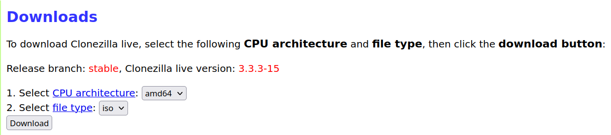

# Backup your toolchain

If you are a network engineer you will undoubted install many tools using:

- homebrew
- apt
- GitHub
- and others

If you want to:

- reinstall Ubuntu and overwrite your current setup
- spin up a new laptop
- or you laptop is stolen

## The theory

Use the Free Open Source Software (FOOS) Clonezilla to create an image on an external drive. Download Clonezilla [Here:](https://clonezilla.org/downloads.php). Select the `stable` link. The page will update to the `Downloads` page. Select the following:

----------------------------------------------------------------

~

----------------------------------------------------------------

Then use [Impression](CH02-Install-Tools.md/#gnome-circle-apps) to create a bootable flash drive. Reboot into the flash drive and follow the onscreen instructions. You can find the Clonezilla live Docs [Here:](https://clonezilla.org/clonezilla-live-doc.php)

----------------------------------------------------------------

The Clonezilla image is your rollback-of-last-resort; a manifest is your *actual* rebuild path — and it's better than booting back into 25.04 repeatedly, because you get a checklist you work through once instead of a system you keep context-switching into.

A few design decisions worth knowing before you run it:

The apt capture uses `apt-mark showmanual`, not `dpkg -l`. That gives you only the packages *you* explicitly asked for — not the thousand-package dependency closure — which is the list you actually reinstall from. And since `nala` writes to the same `dpkg` database, this catches your `nala` installs too; `nala's` a front-end, not a separate inventory. For `Homebrew` it uses `brew bundle dump`, which produces a `Brewfile` you restore with one `brew bundle install` — taps, formulae, and casks in a single restorable artifact.

Two warnings baked into the script that matter for *you* specifically: your netplan files and NetworkManager connections hold the customer WiFi profiles and their PSKs — real secrets — so those go into a clearly-marked `SENSITIVE/` subdir, and you decide whether they're allowed near Insync/Google Drive. And the output lands in `$HOME` on the drive you're about to wipe, so the script ends by reminding you to copy it *off*. That covers your list plus the things easy to forget until you're mid-rebuild and cursing. The extras I added beyond what you asked for, and why they're in there for *you* specifically:

**Group memberships** (`system/groups.txt`) — the reinstall note calls out `dialout` explicitly. That's your serial-console access to Cisco gear; forget it and your USB-serial adapters won't open until you re-add yourself and log out/in. `libvirt`, `kvm`, `wireshark` are in there too.

**Netplan + NetworkManager connections** — your br0 bridge on enp60s0, the VLAN 10/11 split, and all those `90-NM-*` customer WiFi profiles with their PSKs. These land in `SENSITIVE/` because they carry passwords. One firm caveat baked into the notes: don't blind-copy plucky netplan onto 26.04 — interface names usually survive but the syntax and defaults can shift, so review before applying.

**Your cleaned APT sources + keyrings** — captures today's work (the fixed vscode.gpg keyring, the deb822 conversions) as reference so you're not re-deriving the Microsoft key fix from scratch. Reference only, since the ubuntu.sources codename changes on 26.04.

**libvirt VM XML** — dumps the definition for your Ubuntu-24.04-LegacySSH VM (and any others) so you can `virsh define` them back. But the loud warning: **the qcow2 disk images live on the 2TB drive you're wiping.** The XML is tiny; the disks aren't.

`sudo virsh domblklist <vm>` shows their paths — copy those to the 1TB separately or that legacy-SSH runtime is gone. The KVM section does a lot more than list paths, and the extras are the ones that actually save you:

**It walks the backing chain, not just the top disk.** You mentioned your legacy-SSH VM is backed up as a *flattened* qcow2 — but if any VM uses a base+overlay setup, `virsh domblklist` shows only the overlay. Copy that alone and you've orphaned it from its base: a dead VM on the other side. So for each disk it runs `qemu-img info --backing-chain` and pulls *every* member of the chain into the copy list. If a VM is genuinely flattened, the chain is just one file and you get exactly that — no harm, no duplication.

**It sizes everything and totals it.** `kvm/disk-images.txt` is the human-readable report (VM, target device, size, path, with base images tagged `~base1`), and the run prints a grand total — so before you start you know whether your VM images fit on the 1TB alongside the Clonezilla image and your existing backups. Given NVMe prices drove this whole conversation, knowing the number up front matters.

**It generates `copy-vm-disks.sh`** — a ready-to-run helper that rsyncs every image (chain included) to a destination you pass in, with `--sparse` so qcow2 files don't balloon and `--info=progress2` so you can watch it. De-duped, so a base image shared by two VMs copies once.

Two things to flag before you run it:

The whole output folder lands in `$HOME` on the drive you're about to wipe. The script screams about this at the end, but it bears repeating — copy it to the 1TB (or push the non-sensitive parts through `~/Insync`) before you boot the 26.04 installer. A manifest that gets wiped with the system it describes is a cruel joke.

And `SENSITIVE/` holds WiFi passwords and your ssh config. If you route that folder through Insync to Google Drive, you're uploading customer WiFi PSKs to the cloud — your call, but given your line of work I'd keep that subdir on the local 1TB only, or tar+encrypt it. Private ssh keys aren't auto-copied for the same reason; handle `~/.ssh/id_*` yourself.

Run it as your normal user, not under sudo — brew and gh and code all need user context, and the script sudo's itself only for the handful of `/etc` reads that require it. Give it a look before running since it touches sudo, then let me know what it caught and what came back `[skip]` — the skips sometimes point at something worth grabbing by hand.
You need to get back up to speed quickly. Claude wrote a shell script for me when I was migrating from Ubuntu 25.04 to 26.04. I wanted do to a fresh install so that I got Dracut as the Init system.

## The workflow when you're ready to wipe

- Run the script
- Verify the size of the VM qcow2 files
- Copy the VMs to the backup drive


```bash
./system-manifest.sh                                    # inventory
cat ~/system-manifest-*/kvm/disk-images.txt             # eyeball sizes + total
sudo ~/system-manifest-*/kvm/copy-vm-disks.sh /media/mhubbard/Backup/vm-images
```

Here is the output of the script:

```bash hl_lines='1'
┌─[mhubbard@1S1K-G5] - [~/Insync/GD/05_Ubuntu] - [9885]
└─[$] ./system-manifest.sh
Writing manifest to: /home/mhubbard/system-manifest-1S1K-G5-2026-08-08

=== Package managers ===
  [ok]   apt manual packages          -> packages/apt-manual.txt
  [ok]   dpkg full (reference)        -> packages/dpkg-full.txt
  [ok]   apt auto-installed           -> packages/apt-auto.txt
  [ok]   nala history                 -> packages/nala-history.txt
  [ok]   snap packages                -> packages/snap.txt
  [ok]   flatpak apps                 -> packages/flatpak.txt
  [ok]   Brewfile (taps+formulae+casks) -> packages/Brewfile
  [ok]   brew leaves (top-level)      -> packages/brew-leaves.txt
  [ok]   pip (system)                 -> packages/pip-freeze.txt
  [ok]   pip3 (system)                -> packages/pip3-freeze.txt
  [ok]   go version                   -> packages/go-version.txt

=== Dev tooling ===
  [ok]   git global config            -> dev/
  [skip] git ignore global            (not found)
  [ok]   local git repos            -> dev/local-git-repos.txt

=== Shell / zsh ===
  [ok]   .zshrc                       -> shell/
  [ok]   .zshenv                      -> shell/
  [skip] .zprofile                    (not found)
  [skip] .zlogin                      (not found)
  [skip] .p10k.zsh                    (not found)
  [skip] .aliases                     (not found)
  [skip] .functions                   (not found)
  [ok]   zsh history                  -> shell/
  [warn] oh-my-zsh custom             (copy failed)
  [skip] tmux.conf                    (not found)

=== Network config  (br0 / VLANs / customer WiFi) ===
[sudo] password for mhubbard:
  [ok]   /etc/netplan              -> SENSITIVE/netplan/
  [ok]   NM system-connections      -> SENSITIVE/  (has WiFi passwords)
  [ok]   ip addr snapshot             -> network/ip-addr.txt
  [ok]   ip route snapshot            -> network/ip-route.txt
  [ok]   /etc/hosts                   -> network/

=== APT sources + keyrings  (your cleaned config) ===
  [ok]   /etc/apt/sources.list.d    -> system/apt-sources.list.d/
  [ok]   /etc/apt/keyrings          -> system/apt-keyrings/

=== System state ===
  [ok]   groups (id)                  -> system/groups.txt
  [skip] crontab (user)               (not present / no output)
  [ok]   enabled user units           -> system/systemd-user.txt
  [ok]   enabled sys units            -> system/systemd-system.txt
  [ok]   default target               -> system/systemd-target.txt
  [ok]   timezone/locale              -> system/locale.txt
  [ok]   foreign arches               -> system/dpkg-arches.txt
  [ok]   dconf (GNOME settings)     -> system/dconf-dump.ini
  [ok]   user fonts                   -> system/

=== SSH config  (legacy Cisco kex etc.) ===
  [ok]   ssh config                   -> SENSITIVE/
  [ok]   ssh known_hosts              -> SENSITIVE/
  note: private keys NOT auto-copied. Handle ~/.ssh/id_* yourself, encrypted.

=== KVM / libvirt  (VM definitions + disk image paths) ===
  [ok]   VM list -> kvm/vms.txt
  [ok]   dumpxml ghostlock-test-ubuntu
  [ok]   dumpxml Kali-2025.2
  [ok]   dumpxml Ubuntu-24.04-LegacySSH
  [ok]   disk image report -> kvm/disk-images.txt
  [ok]   copy list         -> kvm/disk-copy-list.txt
  >> Total VM disk data to copy off: 132G
  [ok]   copy helper       -> kvm/copy-vm-disks.sh
  !! Disk images live on the drive you will wipe. Run:
        sudo /home/mhubbard/system-manifest-1S1K-G5-2026-08-08/kvm/copy-vm-disks.sh /media/mhubbard/Backup/vm-images

=== Writing reinstall notes ===
  [ok]   REINSTALL-NOTES.md

=== Done ===

Manifest complete: /home/mhubbard/system-manifest-1S1K-G5-2026-08-08  (19M)

  SENSITIVE/  holds WiFi PSKs and ssh config — treat accordingly.
              Do NOT sync to cloud unless you're OK with that.

NEXT (important): this folder is on the drive you're about to wipe.
Copy it off NOW, e.g.:
    cp -a "/home/mhubbard/system-manifest-1S1K-G5-2026-08-08" /media/mhubbard/Backup/     # your 1TB
  or (non-sensitive parts) into ~/Insync to reach Google Drive.

Optional tarball:
    tar czf "/home/mhubbard/system-manifest-1S1K-G5-2026-08-08.tar.gz" -C "/home/mhubbard" "system-manifest-1S1K-G5-2026-08-08"
```

----------------------------------------------------------------

!!! warning
    One caveat on the total: if a VM is running when you copy its image, you're grabbing a live/inconsistent disk. For a clean copy, `virsh shutdown <vm>` first — fine for a migration since you're archiving them anyway, just don't rsync a running VM and expect it to boot cleanly on the other side.

----------------------------------------------------------------

### Check VM qcow2 size

After running the script and before reinstalling run this command to check the VM sizes.
```bash linenums='1' hl_lines='1'
┌─[mhubbard@1S1K-G5] - [~/Insync/GD/05_Ubuntu] - [9887]
└─[$] cat ~/system-manifest-*/kvm/disk-images.txt
```

```bash title='Command Output'
     File: /home/mhubbard/system-manifest-1S1K-G5-2026-08-08/kvm/disk-images.txt
   1 VM                           TARGET       SIZE      SOURCE (chain member)
   2 ghostlock-test-ubuntu        vda          13G       /var/lib/libvirt/images/ghostlock-test-ubuntu.qcow2
   3 Kali-2025.2                  vda          42G       /var/lib/libvirt/images/Kali-2025.2.qcow2
   4 Ubuntu-24.04-LegacySSH       vda          78G       /var/lib/libvirt/images/Ubuntu-24.04-LegacySSH.qcow2
```

----------------------------------------------------------------

### Copy the VM qcow2 files

My drive is named Backup and vm-images is where I keep VM. Change the name to whatever your disk is named.

```bash linenums='1' hl_lines='1'
sudo ~/system-manifest-*/kvm/copy-vm-disks.sh /media/mhubbard/Backup/vm-images
```
