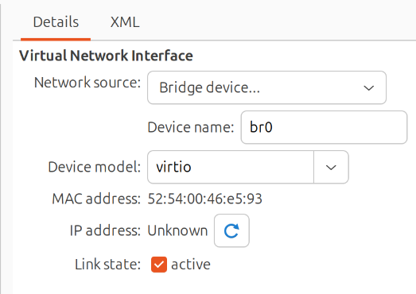

# Setting Up KVM, virt-manager, and Ubuntu 24.04 VM on Ubuntu 25.04

This guide walks through the process of setting up a KVM virtual machine running Ubuntu 24.04 on a host system running Ubuntu 25.04.

---

## Part 1: Install KVM and virt-manager

### 1. Check CPU Virtualization Support

```bash
egrep -c '(vmx|svm)' /proc/cpuinfo
```

- Output `0` = virtualization unsupported or disabled.
- Output `1` or more = virtualization supported.

Ensure virtualization is enabled in BIOS/UEFI.

### 2. Install Required Packages

```bash
sudo apt update
sudo apt install -y qemu-kvm libvirt-daemon-system libvirt-clients bridge-utils virt-manager
```

### 3. Add User to Groups

```bash
sudo usermod -aG libvirt $USER
sudo usermod -aG kvm $USER
```

Log out and back in or reboot.

### 4. Verify libvirt is Running

```bash
virsh list --all
```

If it fails:

```bash
sudo systemctl status libvirtd
```

---

## Part 2: Download Ubuntu 24.04 ISO

Download the ISO:

```bash
wget https://releases.ubuntu.com/24.04/ubuntu-24.04-desktop-amd64.iso -P ~/Downloads
```

---

## Part 3: Create VM with virt-manager

### 1. Launch virt-manager

```bash
virt-manager
```

If it doesn't launch:

```bash
sudo apt install virt-manager
virt-manager
```

### 2. Create New VM

1. Click "Create a new virtual machine"
2. Choose "Local install media (ISO)"
3. Browse to `~/Downloads/ubuntu-24.04-desktop-amd64.iso`
4. Choose OS: Ubuntu 24.04
5. Allocate CPUs and RAM (e.g., 2 CPUs, 4–8 GB RAM)
6. Create a virtual disk (20 GB or more)
7. Name the VM `Ubuntu-24.04-LegacySSH`
8. Check "Customize configuration before install" (optional)
9. Click Finish

### 3. Optional Configurations

- set Network Source to `Bridge...`
- set name to br0
- Set NIC to `virtio`
- Use host-passthrough for CPU
- Choose UEFI or BIOS boot

----------------------------------------------------------------

The NIC setup will look like this.


----------------------------------------------------------------

The network configuration is saved to /etc/netplan/01-netcfg.yaml on the host. Use the following to review it:

`sudo nano /etc/netplan/01-netcfg.yaml`

For the VM I created, this is the contents:

```bash
network:
  version: 2
  renderer: networkd
  ethernets:
    enp60s0:
      dhcp4: no
  bridges:
    br0:
      interfaces: [enp60s0]
      dhcp4: yes
      parameters:
        stp: false
        forward-delay: 0
```

My laptop's Ethernet adapter is enp60s0. I used br0 as the name for the bridge. I added the

- stp: false
- forward-delay: 0

Parameters to the yaml file. I did not want the bridge to send BPDU packets and disable a switch port.

---

## Part 4: Inside Ubuntu 24.04 VM

### 1. Install OpenSSH Server

```bash
sudo apt update
sudo apt install openssh-server
```

### 2. Enable Legacy SSH Support

Edit `/etc/ssh/sshd_config` and add:

```conf
HostKeyAlgorithms +ssh-dss
KexAlgorithms +diffie-hellman-group14-sha1
PubkeyAcceptedKeyTypes +ssh-dss
```

Then:

```bash
sudo systemctl restart ssh
```

This allows SCP/SFTP from Cisco gear requiring old crypto.

---

## Final Tip: Take a Snapshot

After installing and updating Ubuntu 24.04, shut down the VM and take a snapshot using `virt-manager`. This gives you a base image you can roll back or clone later.
