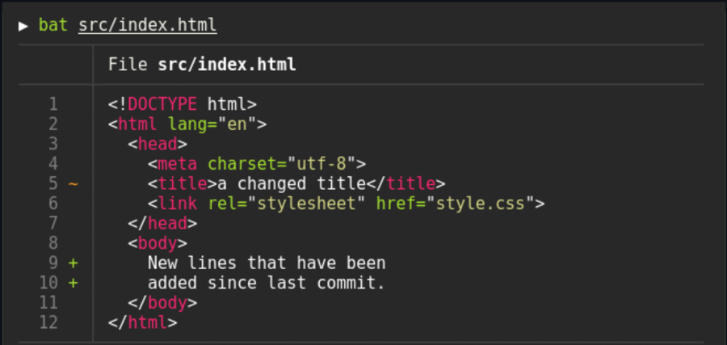

# Build a Great Terminal


----------------------------------------------------------------

:arrow_forward: KEY TAKEAWAYS

- We will install z shell (ZSH) and set it as the default shell.
- Then we will install [Oh-My-ZSH](https://ohmyz.sh/) and configure it for awesomeness.
- We will enable syntax highlighting, autosuggestions, History-substring-search, git integration and docker aliases!!
- We will install `Terminator` which has tabs, logging, and several available plugins.
- You will be the envy of your network engineering friends.

----------------------------------------------------------------

## Why Change Shells

There are several shells available for Ubuntu. To name a few:

- BASH - The default shell Ubuntu. This is the `Bourne Again Shell` first developed for the [GNU Project](https://en.wikipedia.org/wiki/GNU_Project) by Brian Fox in 1989!
- ZSH - My preferred shell! Zsh was created by Paul Falstad in 1990 while he was a student at Princeton University.
- FISH - Friendly Interactive Shell is a smart and user-friendly command line shell for Linux, macOS, and the rest of the family.
- KORN - The KornShell (ksh) is a Unix shell and language based on the Bourne shell (sh) developed in the early 1980s.
- Warp - This is a new, AI based terminal. I have it installed but haven't used it a much. [Warp Website](https://warp.dev)

A google search for `Linux shells` will return many articles on shells.

But I like zsh so that's the one I will cover. It is the standard on recent versions of macOS which is a plus for me since I use Linux and macOS depending on what I am doing.

There is a great add-on to zsh called “Oh My ZSH” which is an unbelievably active community that creates themes and plugins for zsh. We will install it after we install zsh.

Some zsh Features

- Command-line completion.
- History can be shared among all shells.
- Extended file globbing.
- Better variable and array handling.
- Compatibility with shells like bourne shell.
- Spelling correction and autofill of command names.
- Named directories.

----------------------------------------------------------------

## ZSH Installation Instructions

We will need `curl` installed before we start. curl is a tool for communicating with http servers. We will use it a lot in NetDevOps. If you have installed `homebrew` for Linux, still use the apt method. You can run into ssl issues if you use the `homebrew` curl and your system ssl is a different version. I spent hours troubleshooting curl and ssl issues before chatGPT explained the root cause to me.

We will also install `git`, a version control system commonly used in Open Source software

First we will make sure the system is up to date. Open the terminal using `ctrl+alt+t`, and enter:

```bash hl_lines="1"
sudo apt update && sudo apt upgrade -y
```

!!! note
    If you hover the mouse over the command it will bring up a `copy to clipboard` icon on the right. Just click it and the command will be copied to the clipboard. This works everywhere in this document.

Once these commands complete, enter the following to install `curl` and `git`:

```bash hl_lines="1"
sudo apt install curl git -y
```

You may get a message saying the latest versions are already installed. That's fine, it just means you already have the latest versions installed.

Now we can install zsh

```bash hl_lines="1"
sudo apt install zsh -y
```

**Check the version**

```bash hl_lines="1"
zsh --version
```

```bash title='Command Output'
zsh 5.9 (x86_64-ubuntu-linux-gnu)
```

This is the current version as of January, 2026.

You can check your current shell using the echo command:

```bash hl_lines="1"
echo $SHELL
```

```bash title='Command Output'
/usr/bin/bash
```

or

```bash hl_lines="1"
echo $0
```

```bash title='Command Output'
/usr/bin/bash
```

You can see that the current shell is `bash`

You can display all installed shells using:

```bash hl_lines="1"
cat /etc/shells
```

```bash title='Command Output'
# /etc/shells: valid login shells
/bin/sh
/usr/bin/sh
/bin/bash
/usr/bin/bash
/bin/rbash
/usr/bin/rbash
/usr/bin/dash
/usr/bin/screen
/usr/bin/tmux
/bin/zsh
/usr/bin/zsh
/usr/bin/zsh
```

----------------------------------------------------------------

### Make zsh the default shell

Run this to make zsh the default

```bash hl_lines="1"
chsh -s $(which zsh)
```

There is no output from this command.

Verify that zsh is the new shell

```bash  hl_lines="1"
grep zsh /etc/passwd
```

```bash title='Command Output'
mhubbard:x:1000:1000:Michael Hubbard,,,:/home/mhubbard:/usr/bin/zsh
```

The file `/etc/passwd` contains the individual user settings. You can see that my shell is now `/usr/bin/zsh`.

!!! note
    You must log out and back in to make zsh the active shell. I usually reboot at this point instead using `sudo reboot now`

Here is a good article on changing shells if you want more information: [How to change your default shell on Linux with chsh](https://www.howtogeek.com/669835/how-to-change-your-default-shell-on-linux-with-chsh/)

----------------------------------------------------------------

### Configure zsh

Once you log back in, open a terminal with  `ctrl+alt+t`

You will get a message saying `zsh` needs some configuration:

```text hl_lines="12"
This is the Z Shell configuration function for new users,
zsh-newuser-install.

You are seeing this message because you have no zsh startup files
(the files .zshenv, .zprofile, .zshrc, .zlogin in the directory
~).  This function can help you with a few settings that should
make your use of the shell easier.

You can:

(q)  Quit and do nothing.  The function will be run again next time.
(0)  Exit, creating the file ~/.zshrc containing just a comment.
     That will prevent this function being run again.
(1)  Continue to the main menu.
(2)  Populate your ~/.zshrc with the configuration recommended
     by the system administrator and exit (you will need to edit
     the file by hand, if so desired).

--- Type one of the keys in parentheses ---
```

**Choose 0 to just create the .zshrc file and exit**

On Linux/Mac, hidden files start with a `dot`, zsh uses a hidden file named `~/.zshrc` as it's configuration file. BASH uses `~/.bashrc` as its configuration file. You can list the files using:

```bash hl_lines="1"
ls -l ~/.*rc
```

```bash title='Command Output'
.rw-r--r-- 4.1k mhubbard  3 May  2025 󱆃 /home/mhubbard/.bashrc
.rw-rw-r-- 5.3k mhubbard  2 Jan 13:06 󱆃 /home/mhubbard/.zshrc
```

Now we can install a tool called “Oh My ZSH” to customize the shell.

----------------------------------------------------------------

## Install Oh My ZSH

The zsh project uses a `shell script` to install `Oh My ZSH` on your system. In general, you should never copy a shell script from Internet and run it as `root` without carefully reviewing it. There are a lot of malicious scripts on the Internet! But the zsh project is a FOSS project and you can trust the shell script. Plus, the shell script is not run with `root` privileges.

I have it here for convenience but you are free to go to the [zsh project](https://ohmyz.sh/#install) and copy the shell script from the official website.

```bash
sh -c "$(curl -fsSL https://raw.github.com/ohmyzsh/ohmyzsh/master/tools/install.sh)"
```

When the install shell script starts you will see:

```text hl_lines='15 25'
Cloning Oh My Zsh...
remote: Enumerating objects: 1444, done.
remote: Counting objects: 100% (1444/1444), done.
remote: Compressing objects: 100% (1380/1380), done.
remote: Total 1444 (delta 40), reused 1248 (delta 36), pack-reused 0 (from 0)
Receiving objects: 100% (1444/1444), 3.29 MiB | 4.52 MiB/s, done.
Resolving deltas: 100% (40/40), done.
From https://github.com/ohmyzsh/ohmyzsh
 * [new branch]      master     -> origin/master
branch 'master' set up to track 'origin/master'.
Already on 'master'
/home/mhubbard

Looking for an existing zsh config...
Found /home/mhubbard/.zshrc.
The existing .zshrc will be backed up to .zshrc.pre-oh-my-zsh if overwritten.
Make sure your .zshrc contains the following minimal configuration if you choose not to overwrite it:
----------------------------------------
export ZSH="$HOME/.oh-my-zsh"
ZSH_THEME="robbyrussell"
plugins=(git)

source $ZSH/oh-my-zsh.sh
----------------------------------------
Do you want to overwrite it with the Oh My Zsh template? [Y/n] y

         __                                     __
  ____  / /_     ____ ___  __  __   ____  _____/ /_
 / __ \/ __ \   / __ `__ \/ / / /  /_  / / ___/ __ \
/ /_/ / / / /  / / / / / / /_/ /    / /_(__  ) / / /
\____/_/ /_/  /_/ /_/ /_/\__, /    /___/____/_/ /_/
                        /____/                       ....is now installed!

Before you scream Oh My Zsh! please look over the ~/.zshrc file to select plugins, themes, and options.

• Follow us on Twitter: https://twitter.com/ohmyzsh
• Join our Discord server: https://discord.gg/ohmyzsh
• Get stickers, shirts, coffee mugs and other swag: https://shop.planetargon.com/collections/oh-my-zsh
```

----------------------------------------------------------------

### zsh Themes

Oh My ZSH offers a lot of themes. I found one that I really like called duellj. To install it, open the .zshrc file using `nano ~/.zshrc`and change the ZSH-THEME line to:

`ZSH_THEME="duellj"`

I also like “amuse”. It’s similar to duellj but doesn’t put the username/machine name in the terminal. Since I’m on my personal laptop I don’t need that information. To use “amuse”

`ZSH_THEME="amuse"`

You can put a `#` symbol in front of the theme line to comment it out. I leave both themes in my `.zshrc` file and then switch back and forth as needed.

```text
ZSH_THEME="duellj"
# ZSH_THEME="amuse"
```

Here is the prompt with `amuse` as the theme:

```text
~/.config/terminator ⌚ 22:17:17
$
```

You can find all of the themes here: [zsh themes](https://github.com/ohmyzsh/ohmyzsh/wiki/Themes)

Don't forget to update `.zshrc` with `sc` in a terminal.

----------------------------------------------------------------

### Enable Auto Correction

Search for `ENABLE_CORRECTION`. Delete the `#` symbol at the beginning of the line.

```bash
# Uncomment the following line to enable command auto-correction.
ENABLE_CORRECTION="true"
```

----------------------------------------------------------------

### Enable automatic updates

Search for this section and uncomment `zstyle ':omz:update' mode auto`:

```text
# Uncomment one of the following lines to change the auto-update behavior
# zstyle ':omz:update' mode disabled  # disable automatic updates
zstyle ':omz:update' mode auto      # update automatically without asking
# zstyle ':omz:update' mode reminder  # just remind me to update when it's time
```

**Uncomment this line and change to 5 days**

```bash
# Uncomment the following line to change how often to auto-update (in days).
zstyle ':omz:update' frequency 5
```

----------------------------------------------------------------

### Install  plugins

Open the `.zshrc` file using one of the following methods:

- Terminal - `nano ~/.zshrc`
- GUI - `gnome-text-editor ~/.zshrc`

Find the plugin section

`plugins=(git)`

and change it to

```text
plugins=(
            git
            zsh-completions
            zsh-autosuggestions
            history-substring-search
            colored-man-pages
            zsh-docker-aliases
        )
```

----------------------------------------------------------------

### Set the default editor

Especially in the beginning, you will be making a lot of changes to `.zshrc` and you won't want to type `nano ~/.zshrc` or `gnome-text-editor ~/.zshrc` every time. First we will set the default editor so that we can open `~/.zshrc` with an alias.

- Search for `export EDITOR`.
- Then modify the configuration as follows. Remove the `#` symbols on all lines except `# Preferred editor for local and remote sessions`.

In `bash` and `zsh`, lines that start with the `#` symbol are comments.

----------------------------------------------------------------

```bash
# Preferred editor for local and remote sessions
if [[ -n $SSH_CONNECTION ]]; then
   export EDITOR='nano'
 else
   export EDITOR='subl'
 fi
```

----------------------------------------------------------------

This will make `nano` the default editor when you open a file over ssh and `sublime text` the default editor locally. If you haven't installed `sublime text` use the editor of your choice. For example, to use `nano` the line would be `export EDITOR='nano'`

Then add the following after the `preferred editor` section:

----------------------------------------------------------------

```bash
# open ~/.zshrc in using the default editor specified in $EDITOR
alias ec="$EDITOR $HOME/.zshrc"
# rerun ~/.zshrc after making changes
alias sc="exec zsh"
```

The code that we added has two aliases:

- ec - Open ~/.zshrc in the default editor
- sc - reload the zsh configuration using `exec zsh`

----------------------------------------------------------------

### Add an alias for sudo

Scroll down a little further to the `# Example aliases` section. Add this

```bash
_='sudo '
```

 after the line `# alias ohmyzsh="mate ~/.oh-my-zsh"`


----------------------------------------------------------------

### Useful shell scripts

You can include shell scripts in `.zshrc`. Here are two that I find very useful. Place them at the bottom of the `.zshrc` file, right before the `source /usr/share/zsh-syntax-highlighting/zsh-syntax-highlighting.zsh` line.

#### Path

This script displays the path with each statement on a separate line. I find it much easier to read the path that way. I place it near the bottom of the file.

```zsh
# "path" shows current path, one element per line.
# If an argument is supplied, grep for it.
path() {
    test -n "$1" && {
        echo $PATH | perl -p -e "s/:/\n/g;" | grep -i "$1"
    } || {
        echo $PATH | perl -p -e "s/:/\n/g;"
    }
}
```

Now when we type `path` into the terminal we get:

```bash hl_lines="1"
 path
/home/linuxbrew/.linuxbrew/bin
/home/linuxbrew/.linuxbrew/sbin
/home/mhubbard/.local/bin
/home/mhubbard/.cargo/bin
/usr/local/sbin
/usr/local/bin
/usr/sbin
/usr/bin
/sbin
/bin
/snap/bin
/home/linuxbrew/.linuxbrew/opt/fzf/bin
```

----------------------------------------------------------------

#### Make dir

This script uses `mkdir -p` to create a directory, and if necessary, the parent path, then switches to the directory. Open ~/zshrc using `ec` and paste this script in. I place it near the bottom of the file.

```bash
# Create a new directory and enter it
mkd() {
    mkdir -p "$@"
    cd "$@" || exit
}
```

Now type:

```bash hl_lines="1 5 9"
pwd
/home/mhubbard

~ ⌚ 20:09:57
$ mkd 01_test/test
mkdir: created directory '01_test'
mkdir: created directory '01_test/test'

~/01_test/test ⌚ 20:10:12
```

You can see that it created the parent directory `01_test`, then the `test` directory.

----------------------------------------------------------------

### Download the plugins

Close the `~/.zshrc` file by pressing `ctrl+s`, then `ctrl+x`

Copy each line below, paste it into the terminal, and press [enter]:
Copy each of these lines, paste it into the terminal and press [enter]:

```bash
git clone https://github.com/zsh-users/zsh-completions ${ZSH_CUSTOM:=~/.oh-my-zsh/custom}/plugins/zsh-completions
```

```bash
git clone https://github.com/zsh-users/zsh-autosuggestions ${ZSH_CUSTOM:-~/.oh-my-zsh/custom}/plugins/zsh-autosuggestions
```

```bash
git clone https://github.com/zsh-users/zsh-history-substring-search ${ZSH_CUSTOM:-~/.oh-my-zsh/custom}/plugins/zsh-history-substring-search
```

```bash
git clone https://github.com/akarzim/zsh-docker-aliases.git  ~/.oh-my-zsh/custom/plugins/zsh-docker-aliases
```

----------------------------------------------------------------

**Reload the configuration using `exec zsh`**

Now you can type `ec` to edit the `~/.zshrc` file and `sc` to reload zsh. These two aliases will save a ton of time when you are making changes to `~/.zshrc`.

Anytime that you make changes to `~/.zshrc` you have to reload the `.zshrc` configuration.

----------------------------------------------------------------

### Auto Correction in action

Here I have typed `sl -l` instead of `ls -l`:

```bash
sl -l
```

With `ENABLE_CORRECTION="true"` uncommented, for common typos, you will see this prompt:

```bash title='Command Output'
zsh: correct 'sl' to 'ls' [nyae]? y
total 12K
-rw-r--r-- 1 mhubbard mhubbard 6.9K 2024-12-24 17:41 config
drwxrwxr-x 3 mhubbard mhubbard 4.0K 2024-12-18 15:40 plugins/
```

You can press:

- y - for yes
- n - for no
- a - abort
- e - edit

----------------------------------------------------------------

### Plug-ins References

You can read the documentation for the plug-ins on their github repository

- [git](https://github.com/ohmyzsh/ohmyzsh/tree/master/plugins/git) - The git plugin provides many aliases and a few useful functions.
- [zsh completions](https://github.com/zsh-users/zsh-completions) - Additional completion definitions for Zsh
- [zsh autosuggestions](https://github.com/zsh-users/zsh-autosuggestions) - Fish-like fast/unobtrusive autosuggestions for zsh. It suggests commands as you type based on history and completions.
- [History Substring Search](https://github.com/ohmyzsh/ohmyzsh/tree/master/plugins/history-substring-search) -This is a clean-room implementation of the Fish shell's history search feature, where you can type in any part of any command from history and then press chosen keys, such as the UP and DOWN arrows, to cycle through matches.
- [colored man pages](https://github.com/ohmyzsh/ohmyzsh/tree/master/plugins/colored-man-pages) - This plugin adds colors to man pages.
- [zsh docker aliases](https://github.com/akarzim/zsh-docker-aliases) - Defines Docker aliases and functions.

----------------------------------------------------------------

### install zsh-syntax-highlighting

The zsh-syntax-highlighting package is a **MUST**. It does a lot but the most important to me is that as you start typing a command it will be red, as soon as the shell matches it, zsh-syntax-highlighting turns it green. It is hard to describe how useful this in on the terminal until you use it.

----------------------------------------------------------------

**Installation Instructions**

The zsh-syntax-highlighting installation instructions are [zsh highlighting installation instructions](https://github.com/zsh-users/zsh-syntax-highlighting/blob/master/INSTALL.md).

Luckily, zsh-syntax-highlighting is in the Ubuntu repository so installation of the package is simple. Here is how you would check if you weren’t sure:

```bash hl_lines="1"
sudo apt search zsh-syntax-highlighting
```

You should see `zsh-syntax-highlighting 0.7.1-2 [Ubuntu/noble universe]`<br>
`└── Fish shell like syntax highlighting for zsh`

So now we know the package is named `zsh-syntax-highlighting`, we can install it using:

```bash hl_lines="1 2"
sudo apt install zsh-syntax-highlighting && echo "source /usr/share/zsh-syntax-highlighting/zsh-syntax-highlighting.zsh" >> ${ZDOTDIR:-$HOME}/.zshrc
```

These commands install the `zsh-syntax-highlighting` package, then echo the source command into the .zshrc file.

Now enter `sc` to reload zsh.

For reference, the last part of the echo command is a variable. We can echo it to the terminal using:

```bash hl_lines="1"
echo ${ZDOTDIR:-$HOME}/.zshrc
/home/mhubbard/.zshrc
```

Showing that my `.zshrc` is located at `/home/mhubbard/` or the root of my home directory.

!!! Note
    In zsh 5.9, zsh-syntax-highlighting uses the add-zle-hook-widget facility to install a zle-line-pre-redraw hook. Hooks are run in order of registration, therefore, z-sy-h must be sourced (and register its hook) after anything else that adds hooks that modify the command-line buffer.

The line in the .zshrc file they are referring to is `source /usr/share/zsh-syntax-highlighting/zsh-syntax-highlighting.zsh` . I make it the last line to the `.zshrc` file.

**Example of syntax highlighting**

----------------------------------------------------------------


----------------------------------------------------------------


----------------------------------------------------------------

#### Aliases

zsh includes a lot of aliases and we added more with the `git` and `docker aliases` plug-ins. To see what aliases are available, open a terminal, `ctrl+alt+t` and type:

```bash hl_lines="1 17 22-24"
alias
-='cd -'
..='cd ..'
...='cd ../../../'
....='cd ../../../../'
.....=../../../..
......=../../../../..
1='cd -1'
2='cd -2'
3='cd -3'
4='cd -4'
5='cd -5'
6='cd -6'
7='cd -7'
8='cd -8'
9='cd -9'
_='sudo '
afind='ack -il'
back='cd $OLDPWD'
bd='. bd -si'
cat=bat
chmod='chmod -c'
cp='cp -iv'
df='df -h --exclude=squashfs'
diff='diff --color'
```

This is just a small sample of the available aliases. The ones related to changing directories are super useful. You need to spend some time building the muscle memory to use them.

- The `_=`sudo ` - is another good one since you use sudo anytime that you need elevated privileges.
- The `chmod -c` - like verbose but report only when a change is made.
- The `cp=`cp -iv` - adds an interactive prompt if you are copying and the target already exists.
- The `df=`df -h --exclude=squashfs' - runs the Disk File usage command, the `-h` puts the output into "human readable' format and the `--exclude=squashfs'` hides the squash files.

As you can see, there are many tools available to make you  outstanding at the terminal.

----------------------------------------------------------------

#### zsh_stats

zsh has a command that will output a list the top 20 commands you have executed. You can run it periodically and see what commands you are using the most. If possible, you can create an alias and save some typing.

```bash hl_lines="1"
zsh_stats
     1    1026  16.7374%   sudo
     2    312   5.08972%   cd
     3    262   4.27406%   nmap
     4    259   4.22512%   docker
     5    215   3.50734%   git
     6    182   2.969%     grep
     7    176   2.87113%   ping
     8    156   2.54486%   ssh
     9    144   2.3491%    ls
    10    143   2.33279%   mw-manuf
    11    130   2.12072%   ip
    12    121   1.9739%    cat
    13    102   1.66395%   l
    14    88    1.43556%   history
    15    87    1.41925%   nmcli
    16    86    1.40294%   man
    17    82    1.33768%   python3
    18    66    1.07667%   python
    19    60    0.978793%  exa
    20    59    0.96248%   j
```

If you are still using `BASH` you can use this to generate the list:

`history 1 | awk '{CMD[$2]++;count++;}END { for (a in CMD)print CMD[a] " " CMD[a]/count*100 "% " a;}' | grep -v "./" | column -c3 -s " " -t | sort -nr | nl |  head -n10`

----------------------------------------------------------------

### zsh custom dir

The `.zshrc` file is primary configuration file for zsh. But if you start creating a lot of aliases, shell scripts, etc. it will become too large to easily manage.

To solve this problem, oh-my-zsh provides a custom folder, `~/.oh-my-zsh/custom` where you can create an additional configuration file. The file has to have `zsh` as the extension. I use `my-aliases.zsh` for mine. Having your custom aliases and shell scripts in a separate file makes locating your aliases easier.

I found this tip in a Linux administration handbook - preface your personal aliases with a couple unique letters and a dash. I use `mw-` to preface mine. In the terminal I can type `mw- [tab]` and get a list of all of my aliases:

```bash
mw-exa2 -a
mw-bauh              mw-ipen8             mw-nmshprofiles      mw-ssh-stop
mw-bright            mw-kbd               mw-nmshrun           mw-start
mw-chrome            mw-manuf             mw-nmshstate         mw-status
mw-cpu10             mw-mem10             mw-nmshwifi          mw-stop
mw-cpu5              mw-mem5              mw-nmshwifi-pw       mw-tftp
mw-dang              mw-mount             mw-nmwifi            mw-tftp-conf
mw-exa1              mw-nmcli-examples    mw-ntp               mw-tftp-fw
mw-exa2              mw-nmcli-vlan-dhcp   mw-ports             mw-tftp-stop
mw-extip             mw-nmcli-vlan-mac    mw-reload            mw-umount
mw-interface         mw-nmconnectprof     mw-restart           mw-vmnet
mw-interface-vlan    mw-nmlldp            mw-running_services  mw-vmnet-all
mw-ipen0             mw-nmsh-ap           mw-sensors           mw-vmware
mw-ipen6             mw-nmshipv4          mw-ssh
```

Without that trick I would never be able to remember all the aliases that I have created. I will include `my-aliases.zsh` at the end of this chapter. You can press `tab` to scroll through the aliases.

----------------------------------------------------------------

### Copy BASH history

If you have been using bash for a while before installing `zsh` you will want to copy the history over to `zsh`.

I haven't used this script but it has a lot of positive comments in the repo.

**Create the script**

Create an empty text file in your text editor and paste the following into it. Save it as `bash-to-zsh-hist.py` in the root of your home folder.

``` py linenums="1"
#!/usr/bin/env python
# -*- coding: utf-8 -*-
#
# This is how I used it:
# $ cat ~/.bash_history | python bash-to-zsh-hist.py >> ~/.zsh_history

import sys
import time


def main():
    timestamp = None
    for line in sys.stdin.readlines():
        line = line.rstrip('\n')
        if line.startswith('#') and timestamp is None:
            t = line[1:]
            if t.isdigit():
                timestamp = t
                continue
        else:
            sys.stdout.write(': %s:0;%s\n' % (timestamp or time.time(), line))
            timestamp = None


if __name__ == '__main__':
    main()
```

**Run the script**

`cd ~/ && cp .bash_history .bash_history.bak && cat ~/.bash_history | python3 bash-to-zsh-hist.py >> ~/.zsh_history`

That command line uses `&&` to combine multiple commands. The `&&` operator means "Run command 1, if it exits successfully, run command 2", and you can chain as many together as needed.

- cd ~/ --- Change directory to the root of home
- cp    --- copy ~/.bash_history to ~/.bash_history_bak
- cat   --- list the contents of ~/bash_history to screen
- python3 - run the script using python3

Here is the repository. If you have any problems, you might find a solution here:

[bash-to-zsh-hist.py](https://gist.github.com/muendelezaji/c14722ab66b505a49861b8a74e52b274)

----------------------------------------------------------------

### BAT

This is a great upgrade to the built in cat command. The automatic paging, syntax highlighting, Git integration and the ability to show non-printable characters makes replacing cat with bat a no brainer.

There are a lot of other features to bat. You should review the official Git repository at [bat](https://github.com/sharkdp/bat)

**Syntax highlighting**

bat supports syntax highlighting for a large number of programming and markup languages:

----------------------------------------------------------------


----------------------------------------------------------------

**Git integration**

bat communicates with git to show modifications with respect to the index (see left side bar):

----------------------------------------------------------------



----------------------------------------------------------------

**Show non-printable characters**

You can use the -A/--show-all option to show and highlight non-printable characters. There are some malicious text files that embed non-printing characters. Use this method so see them.

----------------------------------------------------------------


----------------------------------------------------------------

**Installation Instructions**

!!! note
    I now install `bat` with homebrew instead of `apt` using `brew install bat`. The Homebrew package is covered below.

**A quick brew install guide**

```bash
/bin/bash -c "$(curl -fsSL https://raw.githubusercontent.com/Homebrew/install/HEAD/install.sh)"
```

Once the install completes, paste these three lines into the terminal and press `enter`

```bash
echo >> /home/mhubbard/.zshrc
echo 'eval "$(/home/linuxbrew/.linuxbrew/bin/brew shellenv)"' >> /home/mhubbard/.zshrc
eval "$(/home/linuxbrew/.linuxbrew/bin/brew shellenv)"
```

These lines add brew to the `.zshrc` file

Install the `build-essential` tools. These are needed by Brew and by many of the tools that we will install later.

```bash
sudo apt install build-essential
```

Finally, install `bat` using:

```bash
brew install bat
```

----------------------------------------------------------------

#### BAT configuration

**Highlighting theme**
Use `bat --list-themes` to get a list of all available themes for syntax highlighting. There are a too many to list, I chose Dracula. You can quickly test a theme you can call `bat` with the --theme=Dracula option. To permanently use the Dracula theme, set the BAT_THEME environment variable to Dracula. Use export BAT_THEME="Dracula" in your shell's startup file to make the change permanent.

`bat` can also be customized with a configuration file. A default configuration file can be created with the --generate-config-file option.

`bat --generate-config-file`

The location of the file is dependent on your operating system. To get the default path for your system, call

```bash hl_lines='1'
 bat --config-file
/home/mhubbard/.config/bat/config
```

Then open the file:

```bash hl_lines='1'
micro /home/mhubbard/.config/bat/config
```

The configuration file is a simple list of command line arguments. Use `bat --help` to see a full list of possible options and values. In addition, you can add comments by prepending a line with the # character.

**Example configuration file:**

```bash
# Set the theme to "TwoDark"
--theme="TwoDark"

# Show line numbers, Git modifications and file header (but no grid)
--style="numbers,changes,header"

# Use italic text on the terminal (not supported on all terminals)
--italic-text=always

# Use C++ syntax for Arduino .ino files
--map-syntax "*.ino:C++"
```

----------------------------------------------------------------

### Hubbard's .zshrc file

```zsh title="Hubbard's .zshrc file"
# If you come from bash you might have to change your $PATH.
export PATH=$HOME/.local/bin:$PATH

# Path to your oh-my-zsh installation.
export ZSH="/home/mhubbard/.oh-my-zsh"

# Set name of the theme to load --- if set to "random", it will
# load a random theme each time oh-my-zsh is loaded, in which case,
# to know which specific one was loaded, run: echo $RANDOM_THEME
# See https://github.com/ohmyzsh/ohmyzsh/wiki/Themes
# ZSH_THEME="duellj"
ZSH_THEME="amuse"

# Set list of themes to pick from when loading at random
# Setting this variable when ZSH_THEME=random will cause zsh to load
# a theme from this variable instead of looking in $ZSH/themes/
# If set to an empty array, this variable will have no effect.
# ZSH_THEME_RANDOM_CANDIDATES=( "robbyrussell" "agnoster" )

# Uncomment the following line to use case-sensitive completion.
# CASE_SENSITIVE="true"

# Uncomment the following line to use hyphen-insensitive completion.
# Case-sensitive completion must be off. _ and - will be interchangeable.
# HYPHEN_INSENSITIVE="true"

# Uncomment the following line to disable bi-weekly auto-update checks.
# DISABLE_AUTO_UPDATE="true"

# Uncomment the following line to automatically update without prompting.
# DISABLE_UPDATE_PROMPT="true"

# Uncomment the following line to change how often to auto-update (in days).
# export UPDATE_ZSH_DAYS=13

# Uncomment the following line if pasting URLs and other text is messed up.
# DISABLE_MAGIC_FUNCTIONS="true"

# Uncomment the following line to disable auto-setting terminal title.
# DISABLE_AUTO_TITLE="true"

# Uncomment the following line to enable command auto-correction.
ENABLE_CORRECTION="true"

# Uncomment the following line to display red dots whilst waiting for completion.
# Caution: this setting can cause issues with multiline prompts (zsh 5.7.1 and newer seem to work)
# See https://github.com/ohmyzsh/ohmyzsh/issues/5765
# COMPLETION_WAITING_DOTS="true"

# Uncomment the following line if you want to disable marking untracked files
# under VCS as dirty. This makes repository status check for large repositories
# much, much faster.
# DISABLE_UNTRACKED_FILES_DIRTY="true"

# Uncomment the following line if you want to change the command execution time
# stamp shown in the history command output.
# You can set one of the optional three formats:
# "mm/dd/yyyy"|"dd.mm.yyyy"|"yyyy-mm-dd"
# or set a custom format using the strftime function format specifications,
# see 'man strftime' for details.
# HIST_STAMPS="mm/dd/yyyy"

# Would you like to use another custom folder than $ZSH/custom?
# ZSH_CUSTOM=/path/to/new-custom-folder

# Which plugins would you like to load?
# Standard plugins can be found in $ZSH/plugins/
# Custom plugins may be added to $ZSH_CUSTOM/plugins/
# Example format: plugins=(rails git textmate ruby lighthouse)
# Add wisely, as too many plugins slow down shell startup.
plugins=(
    git
    zsh-completions
    zsh-autosuggestions
    zsh-syntax-highlighting
    history-substring-search
    aliases
    colored-man-pages
    zsh-docker-aliases
)

source $ZSH/oh-my-zsh.sh

# User configuration

# export MANPATH="/usr/local/man:$MANPATH"

# You may need to manually set your language environment
# export LANG=en_US.UTF-8

# Preferred editor for local and remote sessions
if [[ -n $SSH_CONNECTION ]]; then
   export EDITOR='gedit'
 else
   export EDITOR='subl'
 fi

# Compilation flags
# export ARCHFLAGS="-arch x86_64"

# Set personal aliases, overriding those provided by oh-my-zsh libs,
# plugins, and themes. Aliases can be placed here, though oh-my-zsh
# users are encouraged to define aliases within the ZSH_CUSTOM folder.
# For a full list of active aliases, run `alias`.
#
# Example aliases
# alias zshconfig="mate ~/.zshrc"
# alias ohmyzsh="mate ~/.oh-my-zsh"
# alias python=python3
# alias pip=pip3

# open ~/.zshrc in using the default editor specified in $EDITOR
alias ec="$EDITOR $HOME/.zshrc"
# rerun ~/.zshrc after making changes
alias sc="exec zsh"

eval "$(/home/linuxbrew/.linuxbrew/bin/brew shellenv)"

# Zoxide https://github.com/ajeetdsouza/zoxide
eval "$(zoxide init zsh)"
[ -f ~/.fzf.zsh ] && source ~/.fzf.zsh

# Configure fzf
eval "$(fzf --zsh)"
```

----------------------------------------------------------------

### zsh References

[Install zsh in Ubuntu](https://www.tecmint.com/install-zsh-in-ubuntu/) - The Tecmint site has a tutorial for installing zsh

### Additional tools

- [Optimize your shell experience](https://thoughtbot.com/blog/optimize-your-shell-experience) - Great tips on optimizing your terminal work flow.
- [What's involved in getting a "modern" terminal setup?](https://jvns.ca/blog/2025/01/11/getting-a-modern-terminal-setup)
- [How to See Beautiful Git Project Stats in Your Terminal](https://www.howtogeek.com/how-to-see-beautiful-git-project-stats-in-your-terminal/)
- [The Linux .bashrc File: What It Is, Plus 6 Things You Can Do With It](https://www.howtogeek.com/the-linux-bashrc-file-explained/)
- [Hack The Box themes](https://github.com/botnetbuddies/hackthebox-themes)
[https://blog.confirm.ch/zsh-tips-auto-completion-correction/](zsh tips: Auto completion & correction)
- [git-delta](https://github.com/dandavison/delta) - A syntax highlighting tool for git diffs
- [Modern replacements for Unix tools](https://github.com/ibraheemdev/modern-unix) - a git repo full of modern replacement tools
- [A list of new-ish terminal tools](https://jvns.ca/blog/2022/04/12/a-list-of-new-ish--command-line-tools/)
- [Micro Text Editor](https://micro-editor.github.io/) - a modern and intuitive terminal-based text editor
