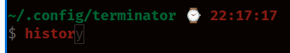
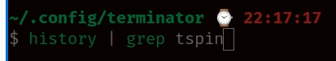
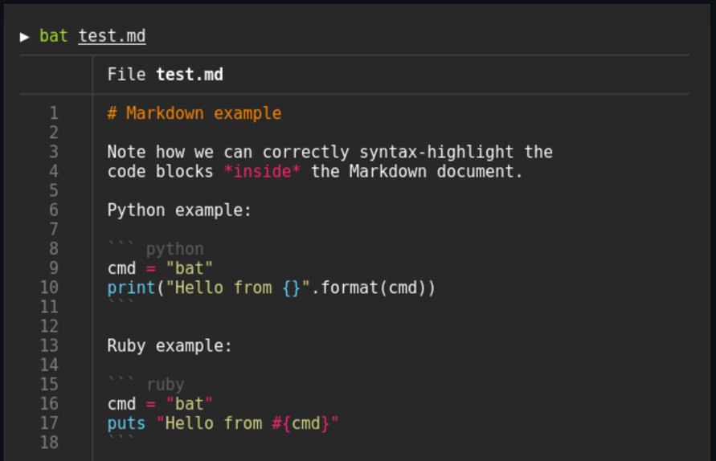
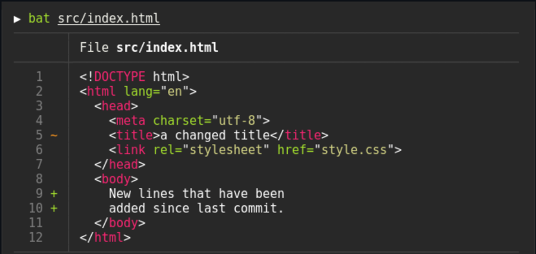
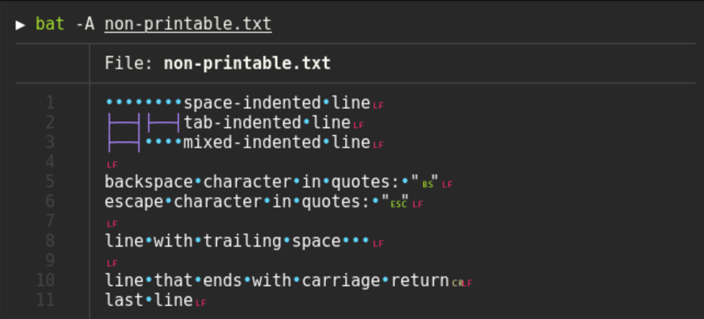

# Build a Great Terminal


----------------------------------------------------------------

:arrow_forward: KEY TAKEAWAYS

- We will install z shell (ZSH) and set it as the default shell.
- Then we will install [Oh-My-ZSH](https://ohmyz.sh/) and configure it for awesomeness.
- We will enable syntax highlighting, autosuggestions, History-substring-search, git integration and docker aliases!!
- We will install `Terminator` which has tabs, logging, and several available plugins.
- You will be the envy of your network engineering friends.

----------------------------------------------------------------

## Why Change Shells

There are several shells available for Ubuntu. To name a few:

- BASH - The default shell Ubuntu. This is the `Bourne Again Shell` first developed for the [GNU Project](https://en.wikipedia.org/wiki/GNU_Project) by Brian Fox in 1989!
- ZSH - My preferred shell! Zsh was created by Paul Falstad in 1990 while he was a student at Princeton University.
- FISH - Friendly Interactive Shell is a smart and user-friendly command line shell for Linux, macOS, and the rest of the family.
- KORN - The KornShell (ksh) is a Unix shell and language based on the Bourne shell (sh) developed in the early 1980s.
- Warp - This is a new, AI based terminal. I have it installed but haven't used it a much. [Warp Website](https://warp.dev)

A google search for `Linux shells` will return many articles on shells.

But I like zsh so that's the one I will cover. It is the standard on recent versions of macOS which is a plus for me since I use Linux and macOS depending on what I am doing.

There is a great add-on to zsh called “Oh My ZSH” which is an unbelievably active community that creates themes and plugins for zsh. We will install it after we install zsh.

Some zsh Features

- Command-line completion.
- History can be shared among all shells.
- Extended file globbing.
- Better variable and array handling.
- Compatibility with shells like bourne shell.
- Spelling correction and autofill of command names.
- Named directories.

----------------------------------------------------------------

## ZSH Installation Instructions

We will need `curl` installed before we start. curl is a tool for communicating with http servers. We will use it a lot in NetDevOps. If you have installed `homebrew` for Linux, still use the apt method. You can run into ssl issues if you use the `homebrew` curl and your system ssl is a different version. I spent hours troubleshooting curl and ssl issues before chatGPT explained the root cause to me.

We will also install `git`, a version control system commonly used in Open Source software

First we will make sure the system is up to date. Open the terminal using `ctrl+alt+t`, and enter:

```bash hl_lines="1"
sudo apt update && sudo apt upgrade -y
```

!!! note
    If you hover the mouse over the command it will bring up a `copy to clipboard` icon on the right. Just click it and the command will be copied to the clipboard. This works everywhere in this document.

Once these commands complete, enter the following to install `curl` and `git`:

```bash hl_lines="1"
sudo apt install curl git -y
```

You may get a message saying the latest versions are already installed. That's fine, it just means you already have the latest versions installed.

Now we can install zsh

```bash hl_lines="1"
sudo apt install zsh -y
```

**Check the version**

```bash hl_lines="1"
zsh --version
```

```bash title='Command Output'
zsh 5.9 (x86_64-ubuntu-linux-gnu)
```

This is the current version as of January, 2026.

You can check your current shell using the echo command:

```bash hl_lines="1"
echo $SHELL
```

```bash title='Command Output'
/usr/bin/bash
```

or

```bash hl_lines="1"
echo $0
```

```bash title='Command Output'
/usr/bin/bash
```

You can see that the current shell is `bash`

You can display all installed shells using:

```bash hl_lines="1"
cat /etc/shells
```

```bash title='Command Output'
# /etc/shells: valid login shells
/bin/sh
/usr/bin/sh
/bin/bash
/usr/bin/bash
/bin/rbash
/usr/bin/rbash
/usr/bin/dash
/usr/bin/screen
/usr/bin/tmux
/bin/zsh
/usr/bin/zsh
/usr/bin/zsh
```

----------------------------------------------------------------

### Make zsh the default shell

Run this to make zsh the default

```bash hl_lines="1"
chsh -s $(which zsh)
```

There is no output from this command.

Verify that zsh is the new shell

```bash  hl_lines="1"
grep zsh /etc/passwd
```

```bash title='Command Output'
mhubbard:x:1000:1000:Michael Hubbard,,,:/home/mhubbard:/usr/bin/zsh
```

The file `/etc/passwd` contains the individual user settings. You can see that my shell is now `/usr/bin/zsh`.

!!! note
    You must log out and back in to make zsh the active shell. I usually reboot at this point instead using `sudo reboot now`

Here is a good article on changing shells if you want more information: [How to change your default shell on Linux with chsh](https://www.howtogeek.com/669835/how-to-change-your-default-shell-on-linux-with-chsh/)

----------------------------------------------------------------

### Configure zsh

Once you log back in, open a terminal with  `ctrl+alt+t`

You will get a message saying `zsh` needs some configuration:

```text hl_lines="12"
This is the Z Shell configuration function for new users,
zsh-newuser-install.

You are seeing this message because you have no zsh startup files
(the files .zshenv, .zprofile, .zshrc, .zlogin in the directory
~).  This function can help you with a few settings that should
make your use of the shell easier.

You can:

(q)  Quit and do nothing.  The function will be run again next time.
(0)  Exit, creating the file ~/.zshrc containing just a comment.
     That will prevent this function being run again.
(1)  Continue to the main menu.
(2)  Populate your ~/.zshrc with the configuration recommended
     by the system administrator and exit (you will need to edit
     the file by hand, if so desired).

--- Type one of the keys in parentheses ---
```

**Choose 0 to just create the .zshrc file and exit**

On Linux/Mac, hidden files start with a `dot`, zsh uses a hidden file named `~/.zshrc` as it's configuration file. BASH uses `~/.bashrc` as its configuration file. You can list the files using:

```bash hl_lines="1"
ls -l ~/.*rc
```

```bash title='Command Output'
.rw-r--r-- 4.1k mhubbard  3 May  2025 󱆃 /home/mhubbard/.bashrc
.rw-rw-r-- 5.3k mhubbard  2 Jan 13:06 󱆃 /home/mhubbard/.zshrc
```

Now we can install a tool called “Oh My ZSH” to customize the shell.

----------------------------------------------------------------

## Install Oh My ZSH

The zsh project uses a `shell script` to install `Oh My ZSH` on your system. In general, you should never copy a shell script from Internet and run it as `root` without carefully reviewing it. There are a lot of malicious scripts on the Internet! But the zsh project is a FOSS project and you can trust the shell script. Plus, the shell script is not run with `root` privileges.

I have it here for convenience but you are free to go to the [zsh project](https://ohmyz.sh/#install) and copy the shell script from the official website.

```bash
sh -c "$(curl -fsSL https://raw.github.com/ohmyzsh/ohmyzsh/master/tools/install.sh)"
```

At the end of the installation, you will see `Do you want to overwrite it with the Oh My Zsh template? [Y/n]`, enter 'y' and press enter.

When the install shell script starts you will see:

```text hl_lines='15 25'
Cloning Oh My Zsh...
remote: Enumerating objects: 1444, done.
remote: Counting objects: 100% (1444/1444), done.
remote: Compressing objects: 100% (1380/1380), done.
remote: Total 1444 (delta 40), reused 1248 (delta 36), pack-reused 0 (from 0)
Receiving objects: 100% (1444/1444), 3.29 MiB | 4.52 MiB/s, done.
Resolving deltas: 100% (40/40), done.
From https://github.com/ohmyzsh/ohmyzsh
 * [new branch]      master     -> origin/master
branch 'master' set up to track 'origin/master'.
Already on 'master'
/home/mhubbard

Looking for an existing zsh config...
Found /home/mhubbard/.zshrc.
The existing .zshrc will be backed up to .zshrc.pre-oh-my-zsh if overwritten.
Make sure your .zshrc contains the following minimal configuration if you choose not to overwrite it:
----------------------------------------
export ZSH="$HOME/.oh-my-zsh"
ZSH_THEME="robbyrussell"
plugins=(git)

source $ZSH/oh-my-zsh.sh
----------------------------------------
Do you want to overwrite it with the Oh My Zsh template? [Y/n] y

         __                                     __
  ____  / /_     ____ ___  __  __   ____  _____/ /_
 / __ \/ __ \   / __ `__ \/ / / /  /_  / / ___/ __ \
/ /_/ / / / /  / / / / / / /_/ /    / /_(__  ) / / /
\____/_/ /_/  /_/ /_/ /_/\__, /    /___/____/_/ /_/
                        /____/                       ....is now installed!

Before you scream Oh My Zsh! please look over the ~/.zshrc file to select plugins, themes, and options.

• Follow us on Twitter: https://twitter.com/ohmyzsh
• Join our Discord server: https://discord.gg/ohmyzsh
• Get stickers, shirts, coffee mugs and other swag: https://shop.planetargon.com/collections/oh-my-zsh
```

----------------------------------------------------------------

## Update the zsh config file

Once oh-my-zsh is installed we need to edit the configuration file.

Open the `.zshrc` file using one of the following methods:

- Terminal - `nano ~/.zshrc`
- GUI - `gnome-text-editor ~/.zshrc`

Follow the instructions below to update the configuration file.

----------------------------------------------------------------

### zsh Themes

Oh My ZSH offers a lot of themes. I found one that I really like called duellj. To install it, open the .zshrc file using `nano ~/.zshrc`and change the ZSH-THEME line to:

`ZSH_THEME="duellj"`

I also like “amuse”. It’s similar to duellj but doesn’t put the username/machine name in the terminal. Since I’m on my personal laptop I don’t need that information. To use “amuse”

`ZSH_THEME="amuse"`

You can put a `#` symbol in front of the theme line to comment it out. I leave both themes in my `.zshrc` file and then switch back and forth as needed.

```text
ZSH_THEME="duellj"
# ZSH_THEME="amuse"
```

Here is the prompt with `amuse` as the theme:

```text
~/.config/terminator ⌚ 22:17:17
$
```

You can find all of the themes here: [zsh themes](https://github.com/ohmyzsh/ohmyzsh/wiki/Themes)

----------------------------------------------------------------

### Enable Auto Correction

Search for `ENABLE_CORRECTION`. Delete the `#` symbol at the beginning of the line.

```bash
# Uncomment the following line to enable command auto-correction.
ENABLE_CORRECTION="true"
```

----------------------------------------------------------------

### Enable automatic updates

Search for this section and uncomment `zstyle ':omz:update' mode auto`:

```bash hl_lines='3'
# Uncomment one of the following lines to change the auto-update behavior
# zstyle ':omz:update' mode disabled  # disable automatic updates
zstyle ':omz:update' mode auto      # update automatically without asking
# zstyle ':omz:update' mode reminder  # just remind me to update when it's time
```

**Uncomment this line and change to 5 days**

```bash hl_lines='2'
# Uncomment the following line to change how often to auto-update (in days).
zstyle ':omz:update' frequency 5
```

----------------------------------------------------------------

### Configure plugins

Find the plugin section

`plugins=(git)`

and change it to

```text
plugins=(
            git
            zsh-completions
            zsh-autosuggestions
            history-substring-search
            colored-man-pages
            zsh-docker-aliases
        )
```

----------------------------------------------------------------

### Set the default editor

Especially in the beginning, you will be making a lot of changes to `.zshrc` and you won't want to type `nano ~/.zshrc` or `gnome-text-editor ~/.zshrc` every time. First we will set the default editor so that we can open `~/.zshrc` with an alias.

- Search for `export EDITOR`.
- Then modify the configuration as follows. Remove the `#` symbols on all lines except `# Preferred editor for local and remote sessions`.

In `bash` and `zsh`, lines that start with the `#` symbol are comments.

----------------------------------------------------------------

```bash
# Preferred editor for local and remote sessions
if [[ -n $SSH_CONNECTION ]]; then
   export EDITOR='nano'
 else
   export EDITOR='micro'
 fi
```

----------------------------------------------------------------

This will make `nano` the default editor when you open a file over ssh and the [micro text editor](https://github.com/micro-editor/micro) the default editor locally. If you haven't installed `micro`, use the editor of your choice. I have recently started using the [Fresh cli text editor](https://github.com/sinelaw/fresh).

For example, to use `fresh` the line would be `export EDITOR='fresh'`

----------------------------------------------------------------

The `if [[ -n $SSH_CONNECTION ]]; then` statement means "Evaluate the string $SSH_CONNECTION and if it's a non zero length then execute the next line. If it's zero length execute the line after `else`.

Here is the output of $SSH_CONNECTION while when I was connected to a remote server:

```bash hl_lines='1'
echo $SSH_CONNECTION
192.168.10.143 40074 192.168.10.127 22
```

It shows that I connected from `192.168l.10.143 port 40074` to the remote server at `192.168.10.127 port 22`.

----------------------------------------------------------------

Then add the following after the `preferred editor` section:

```bash
# open ~/.zshrc in using the default editor specified in $EDITOR
alias ec="$EDITOR $HOME/.zshrc"
# rerun ~/.zshrc after making changes
alias sc="exec zsh"
```

The code that we added has two aliases:

- ec - Open ~/.zshrc in the default editor
- sc - reload the zsh configuration using `exec zsh`

----------------------------------------------------------------

### Add an alias for sudo

Scroll down a little further to the `# Example aliases` section. Add this

```bash
alias _='sudo '
```

 after the line `# alias ohmyzsh="mate ~/.oh-my-zsh"`

Now you can type `_` instead of `sudo`. For example:

```bash hl_lines='1'
_ nano /etc/netplan/91-nw-init.yaml
```

to open the `91-nw-init.yaml` file.

----------------------------------------------------------------

### Add an alias for bat

Add `alias cat='batcat'` alias right below the sudo alias. We will use this alisa once we install `bat` later in this guide. If you don't install `bat`, remove this alias.

----------------------------------------------------------------

### Useful functions

You can include shell functions in `.zshrc`. Here are two that I find very useful. Place them near the bottom of the `.zshrc` file, right before the `source /usr/share/zsh-syntax-highlighting/zsh-syntax-highlighting.zsh` line.

#### Path

This script displays the path with each statement on a separate line. I find it much easier to read the path that way. I place it near the bottom of the file.

```zsh
# "path" shows current path, one element per line.
# If an argument is supplied, grep for it.
path() {
    test -n "$1" && {
        echo $PATH | perl -p -e "s/:/\n/g;" | grep -i "$1"
    } || {
        echo $PATH | perl -p -e "s/:/\n/g;"
    }
}
```

Now when we type `path` into the terminal we get:

```bash hl_lines="1"
 path
 ```

 ```bash title='Command Output'
/home/linuxbrew/.linuxbrew/bin
/home/linuxbrew/.linuxbrew/sbin
/home/mhubbard/.local/bin
/home/mhubbard/.cargo/bin
/usr/local/sbin
/usr/local/bin
/usr/sbin
/usr/bin
/sbin
/bin
/snap/bin
/home/linuxbrew/.linuxbrew/opt/fzf/bin
```

----------------------------------------------------------------

#### Make dir

This script uses `mkdir -p` to create a directory, and if necessary, the parent path, then switches to the directory. Open ~/zshrc using `ec` and paste this script in. I place it near the bottom of the file.

```bash
# Create a new directory and enter it
mkd() {
    mkdir -p "$@"
    cd "$@" || exit
}
```

Now type:

```bash hl_lines="1 5 9"
pwd
/home/mhubbard

~ ⌚ 20:09:57
$ mkd 01_test/test
mkdir: created directory '01_test'
mkdir: created directory '01_test/test'

~/01_test/test ⌚ 20:10:12
```

You can see that it created the parent directory `01_test`, then the `test` directory.

----------------------------------------------------------------

Close the `~/.zshrc` file by pressing `ctrl+s`, then `ctrl+x` if you were in `nano` or `ctrl+s`, then `ctrl+q` if using `fresh` or `micro`.

----------------------------------------------------------------

### Download the plugins

Copy each line below, paste it into the terminal, and press [enter]:

```bash
git clone https://github.com/zsh-users/zsh-completions ${ZSH_CUSTOM:=~/.oh-my-zsh/custom}/plugins/zsh-completions
```

```bash
git clone https://github.com/zsh-users/zsh-autosuggestions ${ZSH_CUSTOM:-~/.oh-my-zsh/custom}/plugins/zsh-autosuggestions
```

```bash
git clone https://github.com/zsh-users/zsh-history-substring-search ${ZSH_CUSTOM:-~/.oh-my-zsh/custom}/plugins/zsh-history-substring-search
```

```bash
git clone https://github.com/akarzim/zsh-docker-aliases.git  ~/.oh-my-zsh/custom/plugins/zsh-docker-aliases
```

----------------------------------------------------------------

**Reload the configuration using `exec zsh`**

Now you can type `ec` to edit the `~/.zshrc` file and `sc` to reload zsh. These two aliases will save a ton of time when you are making changes to `~/.zshrc`.

Anytime that you make changes to `~/.zshrc` you have to reload the `.zshrc` configuration.

----------------------------------------------------------------

### Auto Correction in action

Here I have typed `sl -l` instead of `ls -l`:

```bash
sl -l
```

With `ENABLE_CORRECTION="true"` uncommented, for common typos, you will see this prompt:

```bash title='Command Output'
zsh: correct 'sl' to 'ls' [nyae]? y
total 12K
-rw-r--r-- 1 mhubbard mhubbard 6.9K 2024-12-24 17:41 config
drwxrwxr-x 3 mhubbard mhubbard 4.0K 2024-12-18 15:40 plugins/
```

You can press:

- y - for yes
- n - for no
- a - abort
- e - edit

----------------------------------------------------------------

### Plug-ins References

You can read the documentation for the plug-ins on their github repository

- [git](https://github.com/ohmyzsh/ohmyzsh/tree/master/plugins/git) - The git plugin provides many aliases and a few useful functions.
- [zsh completions](https://github.com/zsh-users/zsh-completions) - Additional completion definitions for Zsh
- [zsh autosuggestions](https://github.com/zsh-users/zsh-autosuggestions) - Fish-like fast/unobtrusive autosuggestions for zsh. It suggests commands as you type based on history and completions.
- [History Substring Search](https://github.com/ohmyzsh/ohmyzsh/tree/master/plugins/history-substring-search) -This is a clean-room implementation of the Fish shell's history search feature, where you can type in any part of any command from history and then press chosen keys, such as the UP and DOWN arrows, to cycle through matches.
- [colored man pages](https://github.com/ohmyzsh/ohmyzsh/tree/master/plugins/colored-man-pages) - This plugin adds colors to man pages.
- [zsh docker aliases](https://github.com/akarzim/zsh-docker-aliases) - Defines Docker aliases and functions.

----------------------------------------------------------------

### zsh-syntax-highlighting

The zsh-syntax-highlighting package is a **MUST**. It does a lot but the most important to me is that as you start typing a command it will be red, as soon as the shell matches it, zsh-syntax-highlighting turns it green. It is hard to describe how useful this in on the terminal until you use it.

----------------------------------------------------------------

**Installation Instructions**

zsh-syntax-highlighting is in the Ubuntu repository so installation of the package is simple. We can install it using:

```bash
sudo apt install zsh-syntax-highlighting && echo "source /usr/share/zsh-syntax-highlighting/zsh-syntax-highlighting.zsh" >> ${ZDOTDIR:-$HOME}/.zshrc
```

These commands install the `zsh-syntax-highlighting` package, then echo the source command into the .zshrc file.

Detailed zsh-syntax-highlighting installation instructions are located here: [zsh highlighting installation instructions](https://github.com/zsh-users/zsh-syntax-highlighting/blob/master/INSTALL.md).

Now enter `sc` to reload zsh.

For reference, the last part of the echo command is a variable. We can echo it to the terminal using:

```bash hl_lines="1"
echo ${ZDOTDIR:-$HOME}/.zshrc
/home/mhubbard/.zshrc
```

Showing that my `.zshrc` is located at `/home/mhubbard/` or the root of my home directory.

!!! Note
    In zsh 5.9 (Current version as of July 24,2026), `zsh-syntax-highlighting` uses the add-zle-hook-widget facility to install a zle-line-pre-redraw hook. Hooks are run in order of registration, therefore, `zsh-syntax-highlighting` must be sourced (and register its hook) after anything else that adds hooks that modify the command-line buffer.

The line in the .zshrc file they are referring to is `source /usr/share/zsh-syntax-highlighting/zsh-syntax-highlighting.zsh`.

**I make it the last line to the `.zshrc` file.**

----------------------------------------------------------------

**Example of syntax highlighting**

----------------------------------------------------------------


----------------------------------------------------------------



----------------------------------------------------------------

### Built in Aliases

zsh includes a lot of aliases and we added more with the `git` and `docker aliases` plug-ins. To see what aliases are available, open a terminal, `ctrl+alt+t` and type:

----------------------------------------------------------------

```bash hl_lines="1 17 22-24"
alias
-='cd -'
..='cd ..'
...='cd ../../../'
....='cd ../../../../'
.....=../../../..
......=../../../../..
1='cd -1'
2='cd -2'
3='cd -3'
4='cd -4'
5='cd -5'
6='cd -6'
7='cd -7'
8='cd -8'
9='cd -9'
_='sudo '
afind='ack -il'
back='cd $OLDPWD'
bd='. bd -si'
cat=bat
chmod='chmod -c'
cp='cp -iv'
df='df -h --exclude=squashfs'
diff='diff --color'
```

----------------------------------------------------------------

This is just a small sample of the available aliases. The ones related to changing directories are super useful. You need to spend some time building the muscle memory to use them.

- The `_=`sudo ` alias is  good one since you use sudo anytime that you need elevated privileges. Add it to your muscle memory! For example, `_ nano /etc/netplan/01-netcfg-dhcp.yaml`
- The `chmod -c` alias is like verbose but reports only when a change is made.
- The `cp=`cp -iv` alias adds an interactive prompt if you are copying and the target already exists.
- The `df=`df -h --exclude=squashfs' alias runs the Disk File usage command, the `-h` puts the output into "human readable' format and the `--exclude=squashfs'` hides the squash files used by snaps.

As you can see, there are many tools available to make you outstanding at the terminal.

----------------------------------------------------------------

### zsh_stats

zsh has a command that will output a list the top 20 commands you have executed. You can run it periodically and see what commands you are using the most. If possible, you can create an alias and save some typing.

```bash hl_lines="1"
zsh_stats
     1    1026  16.7374%   sudo
     2    312   5.08972%   cd
     3    262   4.27406%   nmap
     4    259   4.22512%   docker
     5    215   3.50734%   git
     6    182   2.969%     grep
     7    176   2.87113%   ping
     8    156   2.54486%   ssh
     9    144   2.3491%    ls
    10    143   2.33279%   mw-manuf
    11    130   2.12072%   ip
    12    121   1.9739%    cat
    13    102   1.66395%   l
    14    88    1.43556%   history
    15    87    1.41925%   nmcli
    16    86    1.40294%   man
    17    82    1.33768%   python3
    18    66    1.07667%   python
    19    60    0.978793%  exa
    20    59    0.96248%   j
```

If you are still using `BASH` you can use this to generate the list:

`history 1 | awk '{CMD[$2]++;count++;}END { for (a in CMD)print CMD[a] " " CMD[a]/count*100 "% " a;}' | grep -v "./" | column -c3 -s " " -t | sort -nr | nl |  head -n10`

----------------------------------------------------------------

### Copy BASH history

If you have been using bash for a while before installing `zsh` you will want to copy the history over to `zsh`.

I haven't used this script but it has a lot of positive comments in the repo.

**Create the script**

Create an empty text file in your text editor and paste the following into it. Save it as `bash-to-zsh-hist.py` in the root of your home folder.

``` py linenums="1"
#!/usr/bin/env python
# -*- coding: utf-8 -*-
#
# This is how I used it:
# $ cat ~/.bash_history | python bash-to-zsh-hist.py >> ~/.zsh_history

import sys
import time


def main():
    timestamp = None
    for line in sys.stdin.readlines():
        line = line.rstrip('\n')
        if line.startswith('#') and timestamp is None:
            t = line[1:]
            if t.isdigit():
                timestamp = t
                continue
        else:
            sys.stdout.write(': %s:0;%s\n' % (timestamp or time.time(), line))
            timestamp = None


if __name__ == '__main__':
    main()
```

**Run the script**

`cd ~/ && cp .bash_history .bash_history.bak && cat ~/.bash_history | python3 bash-to-zsh-hist.py >> ~/.zsh_history`

That command line uses `&&` to combine multiple commands. The `&&` operator means "Run command 1, if it exits successfully, run command 2", and you can chain as many together as needed.

- cd ~/ --- Change directory to the root of home
- cp    --- copy ~/.bash_history to ~/.bash_history_bak
- cat   --- list the contents of ~/bash_history to screen
- python3 - run the script using python3

Here is the repository. If you have any problems, you might find a solution here:

[bash-to-zsh-hist.py](https://gist.github.com/muendelezaji/c14722ab66b505a49861b8a74e52b274)

----------------------------------------------------------------

### Bat - A better Cat

This is a great upgrade to the built in cat command. The automatic paging, syntax highlighting, Git integration and the ability to show non-printable characters makes replacing cat with bat a no brainer.

There are a lot of other features to bat. You should review the official Git repository at [bat](https://github.com/sharkdp/bat)

**Syntax highlighting**

bat supports syntax highlighting for a large number of programming and markup languages:

----------------------------------------------------------------



----------------------------------------------------------------

**Git integration**

bat communicates with git to show modifications with respect to the index (see left side bar):

----------------------------------------------------------------



----------------------------------------------------------------

**Show non-printable characters**

You can use the -A/--show-all option to show and highlight non-printable characters. There are some malicious text files that embed non-printing characters. Use this method so see them.

----------------------------------------------------------------



----------------------------------------------------------------

#### Bat Installation Instructions

Bat is in the Ubuntu repository so you can install it with:

```h hl_lines="1"
sudo apt install bat -y
```

**The -p option**

Sometimes you want to use bat but not have the line numbers. In that case use the `-p | --plain` open. For example:

```bash hl_lines='1'
bat -p sshd_config
```

We installed the `alias bat="batcat"` previously.

!!! note
    I now install `bat` with homebrew instead of `apt` using `brew install bat`. The Homebrew package is covered below.

**A quick brew install guide**

```bash
/bin/bash -c "$(curl -fsSL https://raw.githubusercontent.com/Homebrew/install/HEAD/install.sh)"
```

Once the install completes, paste these three lines into the terminal and press `enter`

```bash
echo >> /home/mhubbard/.zshrc
echo 'eval "$(/home/linuxbrew/.linuxbrew/bin/brew shellenv)"' >> /home/mhubbard/.zshrc
eval "$(/home/linuxbrew/.linuxbrew/bin/brew shellenv)"
```

These lines add brew to the `.zshrc` file

Install the `build-essential` tools. These are needed by Brew and by many of the tools that we will install later.

```bash
sudo apt install build-essential
```

Finally, install `bat` using:

```bash
brew install bat
```

----------------------------------------------------------------

#### BAT configuration

**Highlighting theme**
Use `bat --list-themes` to get a list of all available themes for syntax highlighting. There are a too many to list, I chose Coldark-Cold. You can quickly test a theme you can call `bat` with the --theme=Coldark-Cold option. To permanently use the Dracula theme, set the BAT_THEME environment variable to Dracula. Use export BAT_THEME="Coldark-Cold" in your shell's startup file to make the change permanent.

`bat` can also be customized with a configuration file. A default configuration file can be created with the --generate-config-file option.

`bat --generate-config-file`

The location of the file is dependent on your operating system. To get the default path for your system, call

```bash hl_lines='1'
 bat --config-file
/home/mhubbard/.config/bat/config
```

Then open the file:

```bash hl_lines='1'
micro /home/mhubbard/.config/bat/config
```

The configuration file is a simple list of command line arguments. Use `bat --help` to see a full list of possible options and values. In addition, you can add comments by prepending a line with the # character.

**Example configuration file:**

```bash
# Set the theme to "TwoDark"
--theme="TwoDark"

# Show line numbers, Git modifications and file header (but no grid)
--style="numbers,changes,header"

# Use italic text on the terminal (not supported on all terminals)
--italic-text=always

# Use C++ syntax for Arduino .ino files
--map-syntax "*.ino:C++"
```

You can also just export a variable in the `.zshrc` file to set the bat theme. In my `.zshrc` file I have one theme for white backgrounds and one for dark backgrounds.

```bash
# Set bat color theme to Coldark-Cold for white terminals
#export BAT_THEME="Coldark-Cold"

# Set bat color theme to zenburn for dark terminals
export BAT_THEME="zenburn"
```

----------------------------------------------------------------

## zsh custom directory

The `.zshrc` file is primary configuration file for zsh. But if you start creating a lot of aliases, shell scripts, etc. it will become too large to easily manage.

To solve this problem, oh-my-zsh provides a custom folder, `~/.oh-my-zsh/custom` where you can create an additional configuration file. The file has to have `zsh` as the extension. I use `my-aliases.zsh` for mine. Having your custom aliases and shell scripts in a separate file makes locating your aliases easier.

----------------------------------------------------------------

### Naming aliases

I found this tip in a Linux administration handbook - preface your personal aliases with a couple unique letters and a dash. I use `mw-` to preface mine. In the terminal I can type `mw- [tab]` and get a list of all of my aliases:

| mw-bauh   | mw-eza2           | mw-manuf1           | mw-nmcli-vlan-mac | mw-nmshwifi          | mw-ntp              | mw-start     | mw-vmnet     |
|-----------|-------------------|---------------------|-------------------|----------------------|---------------------|--------------|--------------|
| mw-bright | mw-interface      | mw-mem10            | mw-nmconnectprof  | mw-nmshwifi-pw       | mw-ports            | mw-status    | mw-vmnet-all |
| mw-chrome | mw-interface-vlan | mw-mem5             | mw-nmlldp         | mw-nmwifi            | mw-reload           | mw-stop      | mw-vmware    |
| mw-cpu10  | mw-ipen0          | mw-mem-check        | mw-nmsh-ap        | mw-nplan             | mw-restart          | mw-tftp      |              |
| mw-cpu5   | mw-ipen6          | mw-mount            | mw-nmshipv4       | mw-nplan-apply       | mw-running_services | mw-tftp-conf |              |
| mw-dang   | mw-ipen8          | mw-networkd-restart | mw-nmshprofiles   | mw-nplan-br0         | mw-sensors          | mw-tftp-fw   |              |
| mw-extip  | mw-kbd            | mw-nmcli-examples   | mw-nmshrun        | mw-nplan-edit        | mw-ssh              | mw-tftp-stop |              |
| mw-eza1   | mw-manuf          | mw-nmcli-vlan-dhcp  | mw-nmshstate      | mw-nplan_mode_switch | mw-ssh-stop         | mw-umount    |              |

----------------------------------------------------------------

Without that trick I would never be able to remember all the aliases that I have created. I will include `my-aliases.zsh` at the end of this chapter. You can press `tab` to scroll through the aliases.

----------------------------------------------------------------

### My aliases

```bash hl_lines='2'
#call Gnome Text Editor
alias gte="gnome-text-editor"
```

```bash hl_lines='2'
# bd jumps backward in paths https://github.com/vigneshwaranr/bd
alias bd='. bd -si'
```

```bash hl_lines='2'
# run bat instead of cat
alias cat="bat"
```

```bash hl_lines='2'
# gsw - run gnome-screenshot capture window
alias gsw='gnome-screenshot -w'
```

```bash hl_lines='2'
# gsa - run gnome-screenshot capture area
alias gsa='gnome-screenshot -a'
```

```bash hl_lines='1'
alias python=python3
```

```bash hl_lines='2'
# mw-sensors - show temperatures
alias mw-sensors='sensors'
```

```bash hl_lines='2'
# mw-nmcli-examples - show nmcli examples
alias mw-nmcli-examples='man nmcli-examples'
```

```bash hl_lines='2'
# mw-interface - show only interfaces
alias mw-interface='ip addr show | grep ": \w*"'
```

```bash hl_lines='2'
# mw-interface-vlan - show only interfaces with vlan tags
alias mw-interface-vlan='ip addr show | grep ": \w*\.[0-9]*@\w*"'
```

```bash hl_lines='2'
# show the public IP address your are using
# alias mw-extip='dig +short myip.opendns.com @resolver1.opendns.com;dig -6 TXT +short o-o.myaddr.l.google.com @ns1.google.com | sed "s/"//g"'

alias mw-extip='dig +short myip.opendns.com @resolver1.opendns.com; dig -6 TXT +short o-o.myaddr.l.google.com @ns1.google.com | sed "s/\"//g"'
```

```bash hl_lines='2'
# mw-ipen0 - show IP info for wlan0
alias mw-ipen0='ip addr show wlp61s0 | grep "link\|inet";ip route | grep default | grep wlp0s20f3;nmcli dev show wlp61s0 | grep DNS | grep IP4'
```

```bash hl_lines='2'
# mw-ipen6 - show IP info for enp60s0
alias mw-ipen6='ip addr show enp60s0 | grep "link\|inet";ip route | grep default | grep enp60s0;nmcli dev show enp60s0 && grep DNS'
```

```bash hl_lines='1'
alias mw-ipenbr0='ip addr show br0 | grep "link\|inet";ip route | grep default | grep br0;nmcli dev show br0 && grep DNS'
```

```bash hl_lines='2'
# mw-ipen8 - show IP info for enp8s0
alias mw-ipen8='ip addr show enx0050b61ca0c0 | grep "link\|inet";ip route | grep default | grep enx0050b61ca0c0;nmcli dev show enx0050b61ca0c0 | grep DNS | grep IP4;ip addr show enx0050b61ca0c0 | grep inet6'
```

```bash hl_lines='2'
# mw-nmshrun - show status of network manager
alias mw-nmshrun="nmcli -t -f RUNNING general"
```

```bash hl_lines='2'
# mw-nmshstate - show network manager state
alias mw-nmshstate="nmcli -t -f STATE general"
```

```bash hl_lines='2'
# mw-nmcli-vlan-dhcp - add a vlan interface $1 is the vlan id
alias mw-nmcli-vlan-dhcp='(){nmcli con add type vlan con-name vl$1 dev enp60s0 id $1 autoconnect yes}'
```

```bash hl_lines='2'
# mw-nmcli-vlan-mac - change the MAC on the vlan interface $1 vlan id, $2 MAC with colons
alias mw-nmcli-vlan-mac='(){sudo ifconfig enp60s0.$1 hw ether $2}'
```

```bash hl_lines='2'
# mw-nmshprofiles - show network connection profiles $1 is interface name
alias mw-nmshprofiles='(){nmcli -a -f CONNECTIONS device show $1}'
```

```bash hl_lines='2'
# mw-nmconnectprof - connect to an existing network profile $1 - connection name, $2 ifname
alias mw-nmconnectprof='(){nmcli -p connection up "$1" ifname $2}'
```

```bash hl_lines='2'
# mw-nmshipv4 - show profile IPv4 settings. Profile must be active. $1 is profile name I.E. "Wired connection 1"
alias mw-nmshipv4='(){nmcli -a -f IP4 connection show $1}'
```

```bash hl_lines='2'
# mw-nmwifi - show wifi properties
alias mw-nmwifi='nmcli -f GENERAL,WIFI-PROPERTIES dev show $1'
```

```bash hl_lines='2'
# mw-nmsh-ap - lists available Wi-Fi access points known to NetworkManager
alias mw-nmsh-ap='nmcli dev wifi'
```

```bash hl_lines='2'
# show wifi passwords
alias mw-nmshwifi='(){sudo nmcli -a -p device wifi show-password ifname $1}'
```

```bash hl_lines='2'
# show wifi password of saved SSIDs
alias mw-nmshwifi-pw='(){sudo nmcli connection show $1 -s | grep psk:}'
```

```bash hl_lines='2'
# mw-nmlldp list lldp neighbors
alias mw-nmlldp='(){sudo nmcli -a -p device lldp list ifname $1}'
```

```bash hl_lines='2'
# mw-running_services - show running systemd services
alias mw-running_services='systemctl list-units --type=service --state=running'
```

```bash hl_lines='1'
# lookup MAC vendor from OUI. The final command cd - returns to the directory that the command started in.
alias mw-manuf='() {cd /home/mhubbard/Insync/GD/Python/Scripts/prod && python3 manuf.py $1 && cd -}'
alias mw-manuf1='() {z prod && python3 manuf.py $1 && cd -}'
```

```bash hl_lines='1'
#Run the nmap ntp-info script. $1 is the ip of the ntp server.
alias mw-ntp='(){sudo nmap -sU -p 123 --script ntp-info $1}'
```

```bash hl_lines='1'
# start chrome and allow local file read to use xml on the local disk
alias mw-chrome='cd /opt/google/chrome;./chrome --allow-file-access-from-files'
```

```bash hl_lines='2'
# open ~/.oh-my-zsh/custom/my-aliases.zsh
alias ec1='$EDITOR ~/.oh-my-zsh/custom/my-aliases.zsh'
```

```bash hl_lines='2'
# rerun ~/.zshrc after making changes
alias sc='exec zsh'
```

```bash hl_lines='2'
alias wtf='(){man $1}'

```bash hl_lines='2'
# mw-ports show netstat ports
alias mw-ports='netstat -tulanp'
```

```bash hl_lines='2'
# mw-vmware - Recompile VMware kernel
alias mw-vmware='cd /media/mhubbard/Data1/VMs && ./VMware-Update-after-Kernel-upgrade.sh'
```

```bash hl_lines='2'
# mw-vmnet - Change permission on VMware vnet after upgrading the kernel $1 for vmnet number
alias mw-vmnet='(){sudo chmod a+rw /dev/vmnet$1}'
```

```bash hl_lines='2'
# mw-vmnet-all - Change permission on VMware vnet after upgrading the kernel
alias mw-vmnet-all='sudo chmod a+rw /dev/vmnet*'
```

```bash hl_lines='2'
# edit the tftp configuration file
alias mw-tftp-conf='sudo nano /etc/default/tftpd-hpa'
```

```bash hl_lines='2'
# start tftpd-hfa and display the status
alias mw-tftp='systemctl start tftpd-hpa && sudo ufw allow from any to any proto udp port 69 && systemctl status tftpd-hpa && sudo sudo ufw status verbose'
```

```bash hl_lines='2'
#stop tftpd-hfa
alias mw-tftp-stop='systemctl stop tftpd-hpa && sudo ufw delete allow from any to any proto udp port 69 && sudo sudo ufw status verbose'
```

```bash hl_lines='2'
# add tftp to the firewall
alias mw-tftp-fw='sudo ufw allow from any to any proto udp port 69'
```

```bash hl_lines='2'
# start the ssh daemon and display the status
alias mw-ssh='sudo systemctl start ssh && sudo ufw allow 22/tcp comment "Open port ssh tcp port 22" && sudo systemctl status ssh && sudo ufw status numbered'
```

```bash hl_lines='2'
# stop the ssh daemon and display the status
alias mw-ssh-stop='sudo systemctl stop ssh && sudo ufw delete allow 22/tcp && sudo systemctl status ssh && sudo ufw status numbered'
```

```bash
# Start/stop/status of systemd services
alias mw-start='(){sudo systemctl start $1}'
alias mw-restart='(){sudo systemctl restart $1}'
alias mw-reload='(){sudo systemctl reload $1}'
alias mw-stop='(){sudo systemctl stop $1}'
alias mw-status='(){sudo systemctl status $1}'
```

```bash hl_lines='2'
# mount the WD 3TB Drive
alias mw-mount='sudo mount -t ntfs-3g /dev/sdb1 /mnt/WD-3TB'
```

```bash hl_lines='2'
# Unmount the WD 3TB Drive
alias mw-umount='sudo umount /dev/sdb1'
```

```bash hl_lines='2'
# mw-chrome - start chrome and allow local file read
alias mw-chrome='cd /opt/google/chrome;./chrome --allow-file-access-from-files'
```

```bash hl_lines='1'
# Display SSH ciphers
alias mw-ssh='ssh -V && echo "" && echo HostKeyAlgorithms && ssh -Q HostKeyAlgorithms && echo "" && echo MACs && ssh -Q MACs && echo "" && echo KEXAlgorithms && ssh -Q KexAlgorithms'
```

```bash hl_lines='1'
# -p no error if existing, make parent directories as needed -v print a message for each created directory
alias mkdir='mkdir -pv'
```

```bash hl_lines='2'
# Hide the snap file system
alias df="df -h --exclude=squashfs"
```

```bash hl_lines='2'
# -c like verbose but report only when a change is made
alias chmod="chmod -c"

```bash hl_lines='2'
# Jump to previous directory
alias back='cd $OLDPWD'
```

```bash
# -i prompt before overwrite -v verbse
alias cp='cp -iv'
alias mv='mv -iv'
```

```bash hl_lines='2'
# List files with long time format
alias l.='ls -lha --time-style=long-iso --color=auto'
```

#### Brew-installed toolss

We briefly discussed `homebrew`, usually called `brew` in [Gnome Desktop Tools](CH02-Install-Tools.md/#gnome-desktop-tools). It's a package manager that is popular on macOS and Linux. The format to install a tool is `brew install eza`. Brew takes care of any dependencies. To get started with `Homebrew` start at the [Brew homepage](https://brew.sh/)#_target=blank

You can find brew formulas here: [Brew formulas](https://formulae.brew.sh/formula/){target="_blank"}.

To see the packages you have installed use `brew list` or `brew list | grep eza` to limit the output to just eza.

----------------------------------------------------------------

```bash linenums='1' hl_lines='1'
brew list
```

The aliases below use:
- bat - A better cat
- duf - Disk Usage/Free Utility - a better 'df' alternative
- dust - More intuitive version of du in rust
- eza
- lm-sensors
- sniffnet
- tailspin

==> Formulae
<table>
  <tr>
    <td>alsa-lib</td><td>ca-certificates</td><td>expat</td><td>freetype</td><td>htop</td><td>jansson</td>
  </tr>
  <tr>
    <td>bat</td><td>csvlens</td><td>eza</td><td>fresh</td><td>hyperfine</td><td>jq</td>
  </tr>
  <tr>
    <td>bottom</td><td>duf</td><td>fd</td><td>fzf</td><td>icu4c@77</td><td>libgcrypt</td>
  </tr>
  <tr>
    <td>bzip2</td><td>dust</td><td>fontconfig</td><td>gping</td><td>iputils</td><td>libgit2</td>
  </tr>
</table>

----------------------------------------------------------------

#### eza

eza is a modern replacement for the Linux ls command. It uses colours for information by default, helping you distinguish between many types of files, such as whether you are the owner, or in the owning group. See [Eza Rocks](https://eza.rocks/) for more detail.

Run `man eza` to see all the options available.

----------------------------------------------------------------

These aliases have the '--time-style=long-iso --color=auto --icons' options. They print the time in this format: `2026-07-19 21:50', add color, and icons.

```bash hl_lines='1'
alias la='eza -la --time-style=long-iso --color=auto --icons' # ls -la alternative
```

```bash hl_lines='1'
alias ll='eza -l --time-style=long-iso --color=auto --icons --icons'    # ls -l alternative
```

```bash hl_lines='1'
alias ls='eza --time-style=long-iso --color=auto --icons'       # Modern ls with icons
```

#### eza with git

Eza supports a `--git` options that is very useful if you use git.

The Git column shows the version control status of each file or folder relative to your Git repository. The letters you see in your terminal output represent:

-N (New / Untracked): The file or folder is new and has not yet been added or tracked by Git.

-I (Ignored): The item is ignored by Git (typically matched by a pattern inside a .gitignore file, such as python build files or virtual environments).

-M (Modified): A tracked file or directory contains modified changes that have not yet been committed.

-- (Unmodified / Clear): The item is tracked and clean—there are no unstaged changes or pending updates.

!!! Note
    The two character slots in the Git column correspond to Staged status (left) and Unstaged/Workspace status (right). For instance, -N means unstaged/untracked new, whereas N- would mean a newly added file staged for commit.

```bash hl_lines='1'
alias lt='eza --long --header --git --time-style=long-iso --color=auto' # ls with git status
```

----------------------------------------------------------------

```bash title='Command Output'
lt
Permissions Size User     Date Modified    Git Name
drwxrwxr-x     - mhubbard 2026-07-25 12:23  -N img
.rw-rw-r--   45k mhubbard 2025-11-04 20:16  -- Ch01-Using-Ubuntu.md
.rw-rw-r--   56k mhubbard 2026-01-30 14:42  -- CH02-Install-Tools.md
.rw-rw-r--  5.7k mhubbard 2024-11-30 13:12  -- GUI-Tools.md
.rw-rw-r--   15k mhubbard 2025-01-05 13:04  -- Introduction.md
.rw-rw-r--   23k mhubbard 2024-08-20 13:55  -- Join-Ubuntu-24.04-desktop-to-AD.md
.rw-rw-r--   43k mhubbard 2026-03-03 21:56  -- KVM-Bridge.md
.rw-rw-r--  3.3k mhubbard 2025-10-28 08:02  -- kvm_ubuntu_24_vm_setup.md
.rw-rw-r--   12k mhubbard 2024-12-23 16:34  -- Log_tools.md
.rwxrwxr-x   116 mhubbard 2024-12-15 10:59  -- morning.sh
.rw-rw-r--  1.6k mhubbard 2025-08-01 21:55  -- README.md
.rw-rw-r--   799 mhubbard 2025-05-03 13:29  -N Snaps.md
.rw-rw-r--  101k mhubbard 2025-08-07 22:10  -- SSH.md
.rw-rw-r--   66k mhubbard 2026-07-25 12:11  -M terminal.md
```

#### eza with tree view

```bash hl_lines='1'
alias ezat='eza --tree --long --sort=name'
```

----------------------------------------------------------------

```bash title='Command Output'
ezat
drwxrwxr-x     - mhubbard  4 Nov  2025 .
drwxrwxr-x     - mhubbard 25 Jul 12:23 ├── img
drwxrwxr-x     - mhubbard 29 Jan 16:13 │   ├── 'resources-kill (2).png'
drwxrwxr-x     - mhubbard 29 Jan 16:13 │   ├── 'SystemMonitor.resized (2).png'
.rw-rw-r--  1.6k mhubbard 20 Nov  2024 │   ├── All-Apps-New.png
.rw-rw-r--  223k mhubbard  6 Dec  2023 │   ├── alt+~.png
.rw-rw-r--  219k mhubbard 24 Nov  2024 │   ├── AppCenter.png
.rw-r--r--  102k mhubbard 23 Dec  2024 │   ├── bat.png
.rw-r--r--   99k mhubbard 23 Dec  2024 │   ├── bat1.png
.rw-r--r--  104k mhubbard 23 Dec  2024 │   ├── bat2.png
.rw-rw-r--  4.9k mhubbard 25 Nov  2024 │   ├── Bottles.png
.rw-rw-r--   52k mhubbard 10 Dec  2024 │   ├── Bottles1.png
.rw-r--r--   63k mhubbard 11 Aug  2024 │   ├── BR40-VM-Interface.png
```

----------------------------------------------------------------

#### dust

Dust - Like du but more intuitive. Run `man dust` to see a complete list of options. See [Dust on Github](https://github.com/bootandy/dust) for more detail.

```bash
alias du='dust -rR' # Print largest files first, screen reader mode
```

----------------------------------------------------------------

```bash hl_lines='1 3 5 7 9' title='Command Output'
.                       0   58M 100%
img                     1   57M  99%
vesktop1.png            2  1.7M   3%
Tux-Log1.png            2  1.4M   2%
Tux-Tools5.png          2  1.3M   2%
Tux-Log5.png            2  1.3M   2%
Tux-Tools1.png          2  1.3M   2%
Tux-Log9.png            2  1.2M   2%
Tux-ZSH2.png            2  1.2M   2%
```

----------------------------------------------------------------

alias top='btm'              # Better top

#### duf

duf is a replacement for the Linux df command. It report file system space usage. duf creates a table for each device. This alias maps df to duf. See [Duf on GitHub](https://github.com/muesli/duf) for more detail.

```bash hl_lines='1'
alias df='duf'
```

----------------------------------------------------------------


----------------------------------------------------------------

alias ps='procs'             # ps (process viewer with colors)

# Hide loop devices
alias lsblk='lsblk -e7'

# EZA aliases
alias mw-eza1='eza -lT --group-directories-first'

# exa2 display directories first, sort by extension
alias mw-eza2='eza -lF -s extension --group-directories-first'

# alias mw-bright60='xrandr --output eDP-1 --brightness 0.60'

# mw-bright - set a different screen brightness use bright .9
alias mw-bright='xrandr --output eDP-1 --brightness $1'

# mw-kbd set keyboard brightness
alias mw-kbd='sudo brightnessctl --device='dell::kbd_backlight' set $1'

# alias mw-led='sudo brightnessctl --device='intel_backlight' set $1'

# mw-mem5 - get 5 top process eating memory
alias mw-mem5='ps auxf | sort -nr -k 4 | head -5'

# mw-mem10 - get 10 top process eating memory
alias mw-mem10='ps auxf | sort -nr -k 4 | head -10'

# mw-cpu5 - get top process eating cpu
alias mw-cpu5='ps auxf | sort -nr -k 3 | head -5'

# mw-cpu10 - get top process eating cpu
alias mw-cpu10='ps auxf | sort -nr -k 3 | head -10'

# Bauh - Appimage, snap, flatpak manager
alias mw-bauh='() {cd ~/Insync/michael.hubbard999@gmail.com/GoogleDrive/04_Tools/Bauh && source venv/bin/activate && bauh}'

# Tailspin using cx-config.toml
alias tspincx='tspin --print --config-path ~/.config/tailspin/cx-config.toml $1'

# Tailspin using ios-config.toml
alias tspinios='tspin --print --config-path ~/.config/tailspin/IOS-config.toml $1'

# Log into the Juniper vmx router
alias juniper='ssh -i ~/.ssh/juniper_ed25519_key root@192.168.10.162 H3lpd3sk | ct'

# start termianl RPN calculator
alias rpn='flatpak run fr.rubet.rpn'

# Open the expanso base.yml file
alias espanso-base="espanso path | grep Config | awk '{ print \$2\"/match/base.yml\" }' | xargs micro"

# Use Gear Lever from the cli
alias gearlever='flatpak run it.mijorus.gearlever'


# Pull the password from netperf.bufferbloat.net, parse it and pass to betterspeedtest
alias bst="curl https://netperf.bufferbloat.net/ | grep \"Today's passphrase\" | awk '{ print \$4 }' | cut -c 7-20 | xargs -0 -I % betterspeedtest.sh -Z \"%\""

# Check which compositor is running
alias way="echo $XDG_SESSION_TYPE"

----------------------------------------------------------------

### My Functions

Aliases are great, but sometimes it's cleaner to use a function. Claude, Gemini, Copilot and chatGPT are very good at writing zsh functions.

----------------------------------------------------------------

#### Display Memory statistics

If you are running a lot of VMs or other memory intensive applications you may get a message "System Memory low. Process "x" has been killed.

I (and Claude) wrote this function to quickly show me free memory, the swap file usage, any Out of Memory (OOM) messages, and top memory consumers:

```bash linenums='1'
mw-mem-check() {
    echo "=== Memory statistics ==="
    free -h
    echo
    echo "=== Swap ==="
    swapon --show
    echo
    echo "=== OOM killer messages ==="
    sudo dmesg -T | grep -i "out of memory\|killed process"
    echo
    echo "=== Top memory consumers ==="
    \ps -eo pid,user,%mem,%cpu,rss,comm --sort=-%mem \
        | head -11 \
        | awk 'NR==1{print;next}{$5=$5*1024; print}' \
        | numfmt --header --field=5 --to=iec \
        | column -t
    echo
    read -q "reply?Do you want to run procs? (y/n) "
    echo
    if [[ $reply == [yY] ]]; then
        echo
        echo "=== procs full table ==="
        procs --sortd mem
    fi
}
```

```text title='Command Output after I rebooted and memory was cleaned up'
=== Memory statistics ===
                    total        used        free            shared  buff/cache   available
Mem:           30Gi        13Gi       977Mi       3.8Gi        19Gi        16Gi
Swap:          8.0Gi       2.0Mi       8.0Gi

=== Swap ===
NAME      TYPE SIZE USED PRIO
/swap.img file   8G   2M   -2

=== OOM killer messages ===
[sudo] password for mhubbard:
-- no messages were found. No APs had been killed so there was no output --

=== Top memory consumers ===
| PID   | USER     | %MEM | %CPU | RSS  | COMMAND     |
|-------|----------|------|------|------|-------------|
| 32971 | mhubbard | 3.9  | 6.8  | 1.3G | soffice.bin |
| 10845 | mhubbard | 2.5  | 13.6 | 804M | firefox     |
| 4260  | mhubbard | 2.1  | 8.4  | 683M | gnome-shell |
| 5270  | mhubbard | 1.9  | 10.1 | 603M | insync      |
| 40671 | mhubbard | 1.6  | 5.1  | 522M | msedge      |
| 11172 | mhubbard | 1.6  | 1.2  | 517M | Isolated    |
| 11982 | mhubbard | 1.5  | 4.8  | 477M | Isolated    |
| 37662 | mhubbard | 1.4  | 13.5 | 458M | code        |
| 37693 | mhubbard | 1.4  | 6.8  | 443M | code        |
| 11202 | mhubbard | 1.2  | 0.5  | 397M | Isolated    |

Do you want to run procs? (y/n)
```

----------------------------------------------------------------

#### mw-iwget

This one is handy if you do any Wi-Fi work. For the AP that you are connected to it displays:

- the MAC of the AP
- The Interface on you laptop
- The Frequency you are using
- The SSID

----------------------------------------------------------------

```bash linenums='1'
mw-iwget () {
    APMac=`iwgetid -ar`
    IntFace=`iwgetid -f`
    ID=`iwgetid -s`
    echo "AP Mac:" $APMac && echo "Interface:" $IntFace && echo "SSID:" $ID
}
```

----------------------------------------------------------------

```bash title='Command Output'
mw-iwget
AP Mac: 9C:8C:D8:11:7A:F0
Interface: wlp61s0   Frequency:5.18 GHz
SSID: test
```

----------------------------------------------------------------

#### Verify network settings - mw-nplan

My laptop has Wi-Fi and Ethernet. I let the Linux `network manager` manage the Wi-Fi and use `networkd` for the built in Ethernet. This is because I have created a bridge to use with KVM for virtual machines and to be able to connect to vlans different than the Wi-Fi vlan.

That means I can use the GUI settings tool to manage the WiFI but I have to edit a text file to manage the built in Ethernet. If I use a USB Ethernet adapter I can use the `network manager` GUI to manage it.

The functions below:

- Retrieve the IPv4/IPv6 addresses from the WiFi and Br0 interfaces
- prints the default routes - WiFi is lower so that I can still access the internet
- pings `8.8.8.8` using the Wi-Fi interface
- pings `8.8.8.8` using the bridge interface
- shows the DNS settings for both interfaces

----------------------------------------------------------------

```bash linenums='1'
# section header + separator helpers (top-level so they're
# defined once and don't leak/redefine on every call)
_mw_hdr() { printf "\e[31m         %s\e[0m\n\n" "$1"; }
_mw_sep() { printf "\n---------------------\n\n"; }

# return the IPv4 address (with CIDR) of an interface, or "no IP"
_mw_ip() {
    local addrs
    addrs=$(ip -br addr show dev "$1" 2>/dev/null \
            | awk '{$1=$2=""; print}' \
            | tr ' ' '\n' | grep -v '^fe80' | grep . | paste -sd' ')
    print -r -- "${addrs:-no IP}"
}

# verify that netplan is working with
# NetWorkManager for wifi
# networkd for ethternet
mw-nplan() {
    local ethif="br0"          # bridge/ethernet interface (edit as needed)
    local wintf dev

    # detect the wifi interface via sysfs (robust; no perl/proc parsing)
    for dev in /sys/class/net/*(N); do
        [[ -d "$dev/wireless" ]] && { wintf=${dev:t}; break; }
    done

    _mw_hdr "Check that route metrics are correct"
    ip route | grep default
    _mw_sep

    # --- WiFi ---
    if [[ -n "$wintf" ]]; then
        _mw_hdr "ping 8.8.8.8 from Interface $wintf ($(_mw_ip $wintf))"
        ping -I "$wintf" -c 3 8.8.8.8
    else
        _mw_hdr "No wireless interface found — skipping WiFi ping"
    fi
    _mw_sep

    # --- Ethernet / bridge ---
    if [[ -d "/sys/class/net/$ethif" ]]; then
        _mw_hdr "ping 8.8.8.8 from Interface $ethif ($(_mw_ip $ethif))"
        ping -I "$ethif" -c 3 8.8.8.8
    else
        _mw_hdr "Interface $ethif not present — skipping Ethernet ping"
    fi
    _mw_sep

    # --- DNS ---
    _mw_hdr "Check DNS resolution"
    [[ -n "$wintf" ]] && resolvectl status "$wintf"
    printf "\n-------------------------------\n\n"
    [[ -d "/sys/class/net/$ethif" ]] && resolvectl status "$ethif"
}
```

----------------------------------------------------------------

```check title='Command Output'
         Check that route metrics are correct

default via 192.168.10.253 dev wlp61s0 proto dhcp src 192.168.10.143 metric 600
default via 192.168.1.1 dev br0 proto dhcp src 192.168.1.101 metric 1000

---------------------

         ping 8.8.8.8 from Interface wlp61s0 (192.168.10.143/24 fd24:42b2:12ce:0:f1:a0c8:8f6:2055/128 fd24:42b2:12ce:0:ed02:f923:2bfa:f90e/64 fd24:42b2:12ce:0:50db:9203:b498:cd66/64)

PING 8.8.8.8 (8.8.8.8) from 192.168.10.143 wlp61s0: 56(84) bytes of data.
64 bytes from 8.8.8.8: icmp_seq=1 ttl=115 time=23.0 ms
64 bytes from 8.8.8.8: icmp_seq=2 ttl=115 time=13.0 ms
64 bytes from 8.8.8.8: icmp_seq=3 ttl=115 time=12.7 ms

--- 8.8.8.8 ping statistics ---
3 packets transmitted, 3 received, 0% packet loss, time 2002ms
rtt min/avg/max/mdev = 12.661/16.221/23.033/4.818 ms

---------------------

         ping 8.8.8.8 from Interface br0 (192.168.1.101/24 metric 1000)

PING 8.8.8.8 (8.8.8.8) from 192.168.1.101 br0: 56(84) bytes of data.
64 bytes from 8.8.8.8: icmp_seq=1 ttl=114 time=16.0 ms
64 bytes from 8.8.8.8: icmp_seq=2 ttl=114 time=13.1 ms
64 bytes from 8.8.8.8: icmp_seq=3 ttl=114 time=10.9 ms

--- 8.8.8.8 ping statistics ---
3 packets transmitted, 3 received, 0% packet loss, time 2002ms
rtt min/avg/max/mdev = 10.927/13.355/16.023/2.087 ms

---------------------

         Check DNS resolution

Link 4 (wlp61s0)
    Current Scopes: DNS
         Protocols: +DefaultRoute -LLMNR -mDNS -DNSOverTLS DNSSEC=no/unsupported
Current DNS Server: fd24:42b2:12ce::1
       DNS Servers: 192.168.10.222 fd24:42b2:12ce::1
        DNS Domain: pu.pri
     Default Route: yes

-------------------------------

Link 5 (br0)
    Current Scopes: DNS
         Protocols: +DefaultRoute -LLMNR -mDNS -DNSOverTLS DNSSEC=no/unsupported
Current DNS Server: 192.168.10.222
       DNS Servers: 192.168.10.222
     Default Route: yes
```

----------------------------------------------------------------

#### mw-nplan-br0

Displays the status of the bridge interface

```bash linenums='1'
# wait for an interface to get an IPv4 address (default 20s timeout)
# Used with mw-nplan_mode_switch also
_mw_wait_ip() {
    local ifc=$1 waited=0 max=${2:-40}
    until ip -4 addr show dev "$ifc" | grep -q "inet "; do
        sleep 0.5
        (( waited += 1 ))
        (( waited >= max )) && return 1
    done
}

# quick status display for br0
mw-nplan-br0() {
    sudo netplan apply
    _mw_wait_ip br0 || echo "Timed out waiting for br0 IPv4."
    ip a show dev br0
    ip route | grep default
}
```

----------------------------------------------------------------

```text title='Command Output'
mw-nplan-br0
5: br0: <BROADCAST,MULTICAST,UP,LOWER_UP> mtu 1500 qdisc noqueue state UP group default qlen 1000
    link/ether 96:1b:00:a7:1a:98 brd ff:ff:ff:ff:ff:ff
    inet 192.168.1.101/24 metric 1000 brd 192.168.1.255 scope global dynamic br0
       valid_lft 1800sec preferred_lft 1800sec
    inet6 fe80::941b:ff:fea7:1a98/64 scope link proto kernel_ll
       valid_lft forever preferred_lft forever
default via 192.168.1.1 dev br0 proto dhcp src 192.168.1.101 metric 1000
```

----------------------------------------------------------------

#### mw-nplan_mode_switch

Switch between DHCP and Static on the bridge interface. When moving to static, the function opens `/etc/netplan/02-netcfg-static.yaml` in nano so that you can edit it.

!!! Warning
    Be careful when editing the file. It's yaml so it has no sense of humor about errors. The function makes a backup with a `.bak` extension that you can recover from using `sudo cp /etc/netplan/02-netcfg-static.yaml.bak 02-netcfg-static.yaml`

Here is the function.

----------------------------------------------------------------

```bash linenums='1'
# switch netplan br0 between dhcp and static (enable/disable via file extension)
function mw-nplan_mode_switch() {
    local mode=$1
    local static_yaml="/etc/netplan/02-netcfg-static.yaml"
    local static_disabled="/etc/netplan/02-netcfg-static.disabled"
    local dhcp_yaml="/etc/netplan/01-netcfg-dhcp.yaml"
    local dhcp_disabled="/etc/netplan/01-netcfg-dhcp.disabled"

    case "$mode" in
        static)
            echo "Preparing Static IP configuration..."
            [[ -f "$dhcp_yaml" ]] && sudo mv "$dhcp_yaml" "$dhcp_disabled"
            [[ -f "$static_disabled" ]] && sudo mv "$static_disabled" "$static_yaml"
            sudo cp "$static_yaml" "$static_yaml.bak"   # <-- here: file is guaranteed active
            echo "Opening $static_yaml for review/edit. Close the editor when finished."
            # sudo gnome-text-editor "$static_yaml"
            sudo nano "$static_yaml"
            echo "Editor closed."
            ;;
        dhcp)
            echo "Preparing DHCP configuration..."
            [[ -f "$static_yaml" ]] && sudo mv "$static_yaml" "$static_disabled"
            [[ -f "$dhcp_disabled" ]] && sudo mv "$dhcp_disabled" "$dhcp_yaml"
            ;;
        *)
            echo "Usage: mw-nplan_mode_switch [static|dhcp]"
            return 1
            ;;
    esac

    # validate before applying — catches YAML typos without breaking networking
    if ! sudo netplan generate; then
        echo "netplan generate failed — config not applied. Fix the YAML and retry." >&2
        return 1
    fi

    sudo netplan apply

    # wait 10 seconds for br0 to get an address, but don't hang forever
    _mw_wait_ip br0 20 || echo "Timed out waiting for br0 to get an IPv4 address." >&2

    ip a show dev br0
    ip route | grep default
}
```

----------------------------------------------------------------

```bash title='Command Output'
Preparing Static IP configuration...
Opening /etc/netplan/02-netcfg-static.yaml for review/edit. Close the editor when finished.
--Nano opens the yaml file at this point--
Editor closed.
5: br0: <BROADCAST,MULTICAST,UP,LOWER_UP> mtu 1500 qdisc noqueue state UP group default qlen 1000
    link/ether 96:1b:00:a7:1a:98 brd ff:ff:ff:ff:ff:ff
    inet 192.168.10.148/24 brd 192.168.10.255 scope global br0
       valid_lft forever preferred_lft forever
    inet6 fe80::941b:ff:fea7:1a98/64 scope link proto kernel_ll
       valid_lft forever preferred_lft forever
default via 192.168.10.253 dev br0 proto static metric 1000

```

----------------------------------------------------------------

### Hubbard's .zshrc file

```zsh title="Hubbard's .zshrc file"
# If you come from bash you might have to change your $PATH.
export PATH=$HOME/.local/bin:$PATH

# Path to your oh-my-zsh installation.
export ZSH="/home/mhubbard/.oh-my-zsh"

# Set name of the theme to load --- if set to "random", it will
# load a random theme each time oh-my-zsh is loaded, in which case,
# to know which specific one was loaded, run: echo $RANDOM_THEME
# See https://github.com/ohmyzsh/ohmyzsh/wiki/Themes
# ZSH_THEME="duellj"
ZSH_THEME="amuse"

# Set list of themes to pick from when loading at random
# Setting this variable when ZSH_THEME=random will cause zsh to load
# a theme from this variable instead of looking in $ZSH/themes/
# If set to an empty array, this variable will have no effect.
# ZSH_THEME_RANDOM_CANDIDATES=( "robbyrussell" "agnoster" )

# Uncomment the following line to use case-sensitive completion.
# CASE_SENSITIVE="true"

# Uncomment the following line to use hyphen-insensitive completion.
# Case-sensitive completion must be off. _ and - will be interchangeable.
# HYPHEN_INSENSITIVE="true"

# Uncomment one of the following lines to change the auto-update behavior
# zstyle ':omz:update' mode disabled  # disable automatic updates
zstyle ':omz:update' mode auto      # update automatically without asking
# zstyle ':omz:update' mode reminder  # just remind me to update when it's time

# Uncomment the following line to change how often to auto-update (in days).
zstyle ':omz:update' frequency 5

# Uncomment the following line to disable bi-weekly auto-update checks.
# DISABLE_AUTO_UPDATE="true"

# Uncomment the following line to automatically update without prompting.
# DISABLE_UPDATE_PROMPT="true"

# Uncomment the following line to change how often to auto-update (in days).
# export UPDATE_ZSH_DAYS=13

# Uncomment the following line if pasting URLs and other text is messed up.
# DISABLE_MAGIC_FUNCTIONS="true"

# Uncomment the following line to disable colors in ls.
# DISABLE_LS_COLORS="true"

# Uncomment the following line to disable auto-setting terminal title.
# DISABLE_AUTO_TITLE="true"

# Uncomment the following line to enable command auto-correction.
ENABLE_CORRECTION="true"

# Uncomment the following line to display red dots whilst waiting for completion.
# Caution: this setting can cause issues with multiline prompts (zsh 5.7.1 and newer seem to work)
# See https://github.com/ohmyzsh/ohmyzsh/issues/5765
# COMPLETION_WAITING_DOTS="true"

# Uncomment the following line if you want to disable marking untracked files
# under VCS as dirty. This makes repository status check for large repositories
# much, much faster.
# DISABLE_UNTRACKED_FILES_DIRTY="true"

# Uncomment the following line if you want to change the command execution time
# stamp shown in the history command output.
# You can set one of the optional three formats:
# "mm/dd/yyyy"|"dd.mm.yyyy"|"yyyy-mm-dd"
# or set a custom format using the strftime function format specifications,
# see 'man strftime' for details.
# HIST_STAMPS="mm/dd/yyyy"

# Would you like to use another custom folder than $ZSH/custom?
# ZSH_CUSTOM=/path/to/new-custom-folder

# Which plugins would you like to load?
# Standard plugins can be found in $ZSH/plugins/
# Custom plugins may be added to $ZSH_CUSTOM/plugins/
# Example format: plugins=(rails git textmate ruby lighthouse)
# Add wisely, as too many plugins slow down shell startup.
plugins=(
    git
    zsh-completions
    zsh-autosuggestions
    history-substring-search
    colored-man-pages
    zsh-docker-aliases
)

source $ZSH/oh-my-zsh.sh

# User configuration

# export MANPATH="/usr/local/man:$MANPATH"

# You may need to manually set your language environment
# export LANG=en_US.UTF-8

# Preferred editor for local and remote sessions
if [[ -n $SSH_CONNECTION ]]; then
   export EDITOR='gedit'
 else
   export EDITOR='fresh'
 fi

# Compilation flags
# export ARCHFLAGS="-arch x86_64"

# Set personal aliases, overriding those provided by oh-my-zsh libs,
# plugins, and themes. Aliases can be placed here, though oh-my-zsh
# users are encouraged to define aliases within the ZSH_CUSTOM folder.
# For a full list of active aliases, run `alias`.
#
# Example aliases
# alias zshconfig="mate ~/.zshrc"
# alias ohmyzsh="mate ~/.oh-my-zsh"
# alias python=python3
# alias pip=pip3
alias _='sudo '

# Call system ping instead of the brew installed ping
alias ping='/usr/bin/ping "$@"'

# Call system curl instead of the brew installed curl
alias curl='/usr/bin/curl "$@"'

# open ~/.zshrc in using the default editor specified in $EDITOR
alias ec="$EDITOR $HOME/.zshrc"
# rerun ~/.zshrc after making changes
alias sc="exec zsh"

# VS Code Flatpak alias (Wayland-friendly)
alias code="flatpak run com.visualstudio.code"

eval "$(/home/linuxbrew/.linuxbrew/bin/brew shellenv)"

# Zoxide https://github.com/ajeetdsouza/zoxide
eval "$(zoxide init zsh)"
[ -f ~/.fzf.zsh ] && source ~/.fzf.zsh

# Configure fzf
# eval "$(fzf --zsh)"
source <(fzf --zsh)

# onefetch git repository greeter
last_repository=
check_directory_for_new_repository() {
 current_repository=$(git rev-parse --show-toplevel 2> /dev/null)

 if [ "$current_repository" ] && \
    [ "$current_repository" != "$last_repository" ]; then
  onefetch
 fi
 last_repository=$current_repository
}
cd() {
 builtin cd "$@"
 check_directory_for_new_repository
}

# optional, great also when opening shell directly in repository directory
# adds time to startup
check_directory_for_new_repository
export NVM_DIR="$HOME/.nvm"
[ -s "$NVM_DIR/nvm.sh" ] && \. "$NVM_DIR/nvm.sh"  # This loads nvm
[ -s "$NVM_DIR/bash_completion" ] && \. "$NVM_DIR/bash_completion"  # This loads nvm bash_completion

# Set bat color theme to Coldark-Cold for white terminals
#export BAT_THEME="Coldark-Cold"

# Set bat color theme to zenburn for dark terminals
export BAT_THEME="zenburn"

# Tailspin Aliases
alias t-samba='sudo tail -f /var/log/samba/log.smbd | tspin'
alias t-ssh='sudo tail -f /var/log/auth.log | tspin'
alias t-cockpit='sudo journalctl -u cockpit -f | tspin'
alias t-health='sudo journalctl -u smbd -u ssh -u cockpit -f | tspin'

source /usr/share/zsh-syntax-highlighting/zsh-syntax-highlighting.zsh
```

----------------------------------------------------------------

### zsh References

[Install zsh in Ubuntu](https://www.tecmint.com/install-zsh-in-ubuntu/) - The Tecmint site has a tutorial for installing zsh

### Additional tools

- [Optimize your shell experience](https://thoughtbot.com/blog/optimize-your-shell-experience) - Great tips on optimizing your terminal work flow.
- [What's involved in getting a "modern" terminal setup?](https://jvns.ca/blog/2025/01/11/getting-a-modern-terminal-setup)
- [How to See Beautiful Git Project Stats in Your Terminal](https://www.howtogeek.com/how-to-see-beautiful-git-project-stats-in-your-terminal/)
- [The Linux .bashrc File: What It Is, Plus 6 Things You Can Do With It](https://www.howtogeek.com/the-linux-bashrc-file-explained/)
- [Hack The Box themes](https://github.com/botnetbuddies/hackthebox-themes)
[https://blog.confirm.ch/zsh-tips-auto-completion-correction/](zsh tips: Auto completion & correction)
- [git-delta](https://github.com/dandavison/delta) - A syntax highlighting tool for git diffs
- [Modern replacements for Unix tools](https://github.com/ibraheemdev/modern-unix) - a git repo full of modern replacement tools
- [A list of new-ish terminal tools](https://jvns.ca/blog/2022/04/12/a-list-of-new-ish--command-line-tools/)
- [Micro Text Editor](https://micro-editor.github.io/) - a modern and intuitive terminal-based text editor
- [Fresh cli text editor](https://github.com/sinelaw/fresh) - `curl https://raw.githubusercontent.com/sinelaw/fresh/refs/heads/master/scripts/install.sh | sh`
